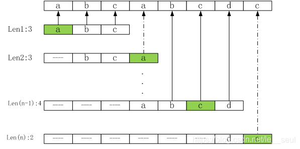

## day6无重复字符的最长子串

>给定一个字符串，请你找出其中不含有重复字符的 最长子串 的长度。

示例 1:
```
输入: "abcabcbb"
输出: 3
解释: 因为无重复字符的最长子串是 "abc"，所以其长度为 3。
```
示例 2:
```
输入: "bbbbb"
输出: 1
解释: 因为无重复字符的最长子串是 "b"，所以其长度为 1。
```
示例 3:
```
输入: "pwwkew"
输出: 3
解释: 因为无重复字符的最长子串是 "wke"，所以其长度为 3。
     请注意，你的答案必须是 子串 的长度，"pwke" 是一个子序列，不是子串。
```

**解题**(作者：LeetCode-Solution)  

### 方法一：滑动窗口
思路和算法  
我们先用一个例子来想一想如何在较优的时间复杂度内通过本题。

我们不妨以示例一中的字符串`{abcabcbb}abcabcbb` 为例，找出 从每一个字符开始的，不包含重复字符的最长子串，那么其中最长的那个字符串即为答案。对于示例一中的字符串，我们列举出这些结果，其中括号中表示选中的字符以及最长的字符串：

+ 以 (a)bcabcbb 开始的最长字符串为 (abc)abcbb；  
+ 以 a(b)cabcbb 开始的最长字符串为 a(bca)bcbb；
+ 以 ab(c)abcbb 开始的最长字符串为 ab(cab)cbb；
+ 以 abc(a)bcbb 开始的最长字符串为 abc(abc)bb；
+ 以 abca(b)cbb 开始的最长字符串为 abca(bc)bb；
+ 以abcab(c)bb 开始的最长字符串为 abcab(cb)b；
+ 以 abcabc(b)b 开始的最长字符串为 abcabc(b)b；
+ 以 abcabcb(b) 开始的最长字符串为 abcabcb(b)  

发现了什么？如果我们依次递增地枚举子串的起始位置，那么子串的结束位置也是递增的！这里的原因在于，假设我们选择字符串中的第 `k`个字符作为起始位置，并且得到了不包含重复字符的最长子串的结束位置为` r
k`。那么当我们选择第 `k+1` 个字符作为起始位置时，首先从 `k+1` 到 `rk`的字符显然是不重复的，并且由于少了原本的第 `k` 个字符，我们可以尝试继续增大 `rk`，直到右侧出现了重复字符为止。  

这样以来，我们就可以使用**滑动窗口**来解决这个问题了：

+ 我们使用两个指针表示字符串中的某个子串（的左右边界）。其中左指针代表着上文中「枚举子串的起始位置」，而右指针即为上文中的 `rk` ；

+ 在每一步的操作中，我们会将左指针向右移动一格，表示**我们开始枚举下一个字符作为起始位置**，然后我们可以不断地向右移动右指针，但需要保证这两个指针对应的子串中没有重复的字符。在移动结束后，这个子串就对应着**以左指针开始的，不包含重复字符的最长子串**。我们记录下这个子串的长度；

+ 在枚举结束后，我们找到的最长的子串的长度即为答案。

**判断重复字符**

在上面的流程中，我们还需要使用一种数据结构来判断 是否有重复的字符，常用的数据结构为哈希集合（即 C++ 中的 std::unordered_set，Java 中的 HashSet，Python 中的 set, JavaScript 中的 Set）。在左指针向右移动的时候，我们从哈希集合中移除一个字符，在右指针向右移动的时候，我们往哈希集合中添加一个字符。

```C
var lengthOfLongestSubstring = function(s) {
    // 哈希集合，记录每个字符是否出现过
    const occ = new Set();
    const n = s.length;
    // 右指针，初始值为 -1，相当于我们在字符串的左边界的左侧，还没有开始移动
    let rk = -1, ans = 0;
    for (let i = 0; i < n; ++i) {
        if (i != 0) {
            // 左指针向右移动一格，移除一个字符
            occ.delete(s.charAt(i - 1));
        }
        while (rk + 1 < n && !occ.has(s.charAt(rk + 1))) {
            // 不断地移动右指针
            occ.add(s.charAt(rk + 1));
            ++rk;
        }
        // 第 i 到 rk 个字符是一个极长的无重复字符子串
        ans = Math.max(ans, rk - i + 1);
    }
    return ans;
};

```

**复杂度分析**

+ 时间复杂度：O(N)，其中 N 是字符串的长度。左指针和右指针分别会遍历整个字符串一次。

+ 空间复杂度：O(∣Σ∣)，其中 Σ 表示字符集（即字符串中可以出现的字符），∣Σ∣ 表示字符集的大小。在本题中没有明确说明字符集，因此可以默认为所有 ASCII 码在 [0,128) 内的字符，即∣Σ∣=128。我们需要用到哈希集合来存储出现过的字符，而字符最多有 ∣Σ∣ 个，因此空间复杂度为 O(∣Σ∣)。


### 方法二：
思路：遍历字符串，当遍历到的项与前面出现的项重复时，记录此时的字符串长度并删除与该项重复的前面的项，继续遍历。最后判断最长子串。
以示例1为例：


```
var lengthOfLongestSubstring = function(s) {
    let arr = []; max = 0;
    for(let i = 0; i < s.length; i++) {
        let index = arr.indexOf(s[i]);
        if(index !== -1) {
            arr.splice(0, index + 1);
        }
        arr.push(s[i]);
        max = Math.max(arr.length, max);
    }
    return max;
};

```

[力扣（LeetCode）](https://leetcode-cn.com/problems/longest-substring-without-repeating-characters)
