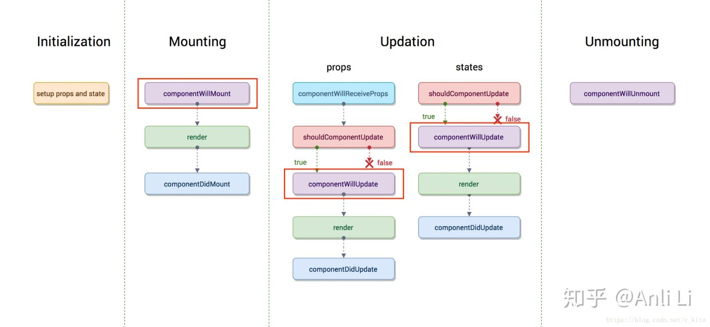
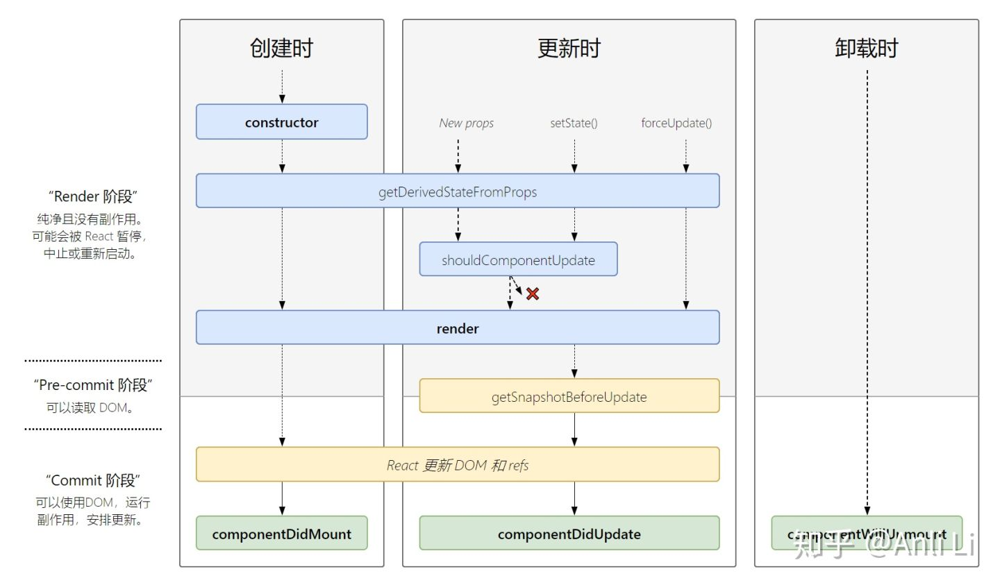

## React 16.3之前


## 1. 挂载卸载过程
### 1.1. constructor()  
`constructor()`中完成了React数据的初始化，它接受两个参数：props和context，当想在函数内部使用这两个参数时，需使用super()传入这两个参数。
注意：只要使用了constructor()就必须写super(),否则会导致this指向错误。

###  1.2.componentWillMount()  
`componentWillMount()`一般用的比较少，它更多的是在服务端渲染时使用。它代表的过程是组件已经经历了constructor()初始化数据后，但是还未渲染DOM时。

### 1.3.componentDidMount()  
**组件第一次渲染完成，此时dom节点已经生成，可以在这里调用ajax请求**，返回数据setState后组件会重新渲染

###  1.4.componentWillUnmount ()  
在此处完成组件的卸载和数据的销毁。

+ clear你在组建中所有的setTimeout,setInterval
+ 移除所有组建中的监听 removeEventListener

## 2. 更新过程
### 2.1. componentWillReceiveProps (nextProps)  
+ **在接受父组件改变后的props需要重新渲染组件时用到的比较多**
+ 接受一个参数nextProps
+ 通过对比nextProps和this.props，将nextProps的state为当前组件的state，从而重新渲染组件
```bash
  componentWillReceiveProps (nextProps) {
    nextProps.openNotice !== this.props.openNotice&&this.setState({
        openNotice:nextProps.openNotice
    }，() => {
      console.log(this.state.openNotice:nextProps)
      //将state更新为nextProps,在setState的第二个参数（回调）可以打         印出新的state
  })
}
```

### 2.2.shouldComponentUpdate(nextProps,nextState)  
+ 主要用于性能优化(部分更新)
+ 唯一用于控制组件重新渲染的生命周期，由于在react中，setState以后，state发生变化，组件会进入重新渲染的流程，在这里return false可以阻止组件的更新
+ 因为react父组件的重新渲染会导致其所有子组件的重新渲染，这个时候其实我们是不需要所有子组件都跟着重新渲染的，因此需要在子组件的该生命周期中做判断

## 2.3.componentWillUpdate (nextProps,nextState)
`shouldComponentUpdate`返回true以后，组件进入重新渲染的流程，进入componentWillUpdate,这里同样可以拿到nextProps和nextState。

## 2.4.componentDidUpdate(prevProps,prevState)
组件更新完毕后，react只会在第一次初始化成功会进入componentDidmount,之后每次重新渲染后都会进入这个生命周期，这里可以拿到prevProps和prevState，即更新前的props和state。

## 2.5.render()
render函数会插入jsx生成的dom结构，react会生成一份虚拟dom树，在每一次组件更新时，在此react会通过其diff算法比较更新前后的新旧DOM树，比较以后，找到最小的有差异的DOM节点，并重新渲染。


## React 16.4之后


+ 初始化阶段  
  + constructor 构造函数
  + getDefaultProps props默认值
  + getInitialState state默认值

+ 挂载阶段
  + staticgetDerivedStateFromProps(props,state)
  + render
  + componentDidMount
>getDerivedStateFromProps：组件每次被 rerender的时候，包括在组件构建之后(虚拟 dom之后，实际 dom挂载之前)，每次获取新的 props或 state之后；每次接收新的props之后都会返回一个对象作为新的 state，返回null则说明不需要更新 state；配合 componentDidUpdate，可以覆盖 componentWillReceiveProps的所有用法

+ 更新阶段
  + staticgetDerivedStateFromProps(props,state)
  + shouldComponentUpdate
  + render
  + getSnapshotBeforeUpdate(prevProps,prevState)
  + componentDidUpdate
>getSnapshotBeforeUpdate：触发时间: update发生的时候，在 render之后，在组件 dom渲染之前；返回一个值，作为 componentDidUpdate的第三个参数；配合 componentDidUpdate, 可以覆盖 componentWillUpdate的所有用法

+ 卸载阶段  
 componentWillUnmount
+ 错误处理    
componentDidCatch
>React16新的生命周期弃用了 componentWillMount、componentWillReceivePorps，componentWillUpdate新增了 getDerivedStateFromProps、getSnapshotBeforeUpdate来代替弃用的三个钩子函数。

React16并没有删除这三个钩子函数，但是不能和新增的钩子函数混用， React17将会删除这三个钩子函数，新增了对错误的处理（ componentDidCatch）
