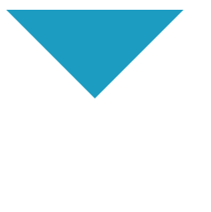

## 用css创建一个三角形，并简述原理

```C
<div class='rect'></div>
<style>
    .rect {
      width: 0;
      height: 0;
      background-color: #fff;
      border-right: 100px solid rgb(34, 230, 220);
      border-left: 100px solid rgb(202, 146, 25);
      border-top: 100px solid rgb(29, 156, 194);
      border-bottom: 100px solid rgb(16, 204, 101);
    }
  </style>
```


创建一个div，宽高都为0，实现效果如下，发现border的四个边都是一个三角形，要实现三角形只需将其中几个边background设置为transparent，即可得到三角形

```C
<style>
  .rect {
    width: 0;
    height: 0;
    background-color: #fff;
    border-right: 100px solid transparent;
    border-left: 100px solid transparent;
    border-top: 100px solid rgb(29, 156, 194);
    border-bottom: 100px solid transparent;
  }
</style>
```


---
