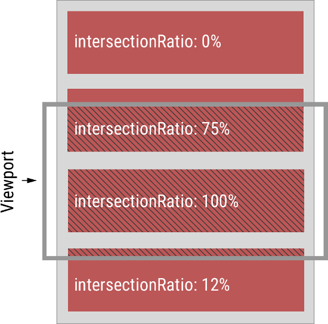

# intersection api——[阮一峰教程](http://www.ruanyifeng.com/blog/2016/11/intersectionobserver_api.html)
**传统的方法**  
网页开发时，常常需要了解某个元素是否进入了"视口"（viewport），即用户能不能看到它；  
传统的实现方法是，监听到`scroll`事件后，调用目标元素（绿色方块）的`getBoundingClientRect()`方法，得到它对应于视口左上角的坐标，再判断是否在视口之内。这种方法的缺点是，由于scroll事件密集发生，计算量很大，容易造成性能问题。

 # 一.api用法
```bash
let io= new IntersectionOberser( entries => {
    console.log(entries);
  },options)
```
参数：  

+ callback：是可见性变化时的回调函数，callback函数的参数（entries）是一个数组，每个成员都是一个IntersectionObserverEntry对象。举例来说，如果同时有两个被观察的对象的可见性发生变化，entries数组就会有两个成员。
+ option：配置参数，可选

构造函数的返回值是一个观察器实例。实例的observe方法可以指定观察哪个 DOM 节点。

```
// 开始观察
io.observe(document.getElementById('example'));
io.observe(elementB); //多次观察


// 停止观察
io.unobserve(element);

// 关闭观察器
io.disconnect();
```

---
## 二、IntersectionObserverEntry 对象
IntersectionObserverEntry对象提供目标元素的信息，一共有六个属性。

```
{
  time: 3893.92,
  rootBounds: ClientRect {
    bottom: 920,
    height: 1024,
    left: 0,
    right: 1024,
    top: 0,
    width: 920
  },
  boundingClientRect: ClientRect {
     // ...
  },
  intersectionRect: ClientRect {
    // ...
  },
  intersectionRatio: 0.54,
  target: element
}
```

每个属性的含义如下。
```
time：可见性发生变化的时间，是一个高精度时间戳，单位为毫秒
target：被观察的目标元素，是一个 DOM 节点对象
rootBounds：根元素的矩形区域的信息，getBoundingClientRect()方法的返回值，如果没有根元素（即直接相对于视口滚动），则返回null
boundingClientRect：目标元素的矩形区域的信息
intersectionRect：目标元素与视口（或根元素）的交叉区域的信息
intersectionRatio：目标元素的可见比例，即intersectionRect占boundingClientRect的比例，完全可见时为1，完全不可见时小于等于0
```

---
## 三、Option 对象
IntersectionObserver构造函数的第二个参数是一个配置对象。它可以设置以下属性。

### 1 threshold 属性
threshold属性决定了什么时候触发回调函数。它是一个数组，每个成员都是一个门槛值，默认为[0]，即交叉比例（intersectionRatio）达到0时触发回调函数。

```
new IntersectionObserver(
  entries => {/* ... */},
  {
    threshold: [0, 0.25, 0.5, 0.75, 1]
  }
);
```
用户可以自定义这个数组。比如，[0, 0.25, 0.5, 0.75, 1]就表示当目标元素 0%、25%、50%、75%、100% 可见时，会触发回调函数。


### 2 root 属性，rootMargin 属性
很多时候，目标元素不仅会随着窗口滚动，还会在容器里面滚动（比如在iframe窗口里滚动）。容器内滚动也会影响目标元素的可见性

IntersectionObserver API 支持容器内滚动。root属性指定目标元素所在的容器节点（即根元素）。注意，容器元素必须是目标元素的祖先节点。
```

var opts = {
  root: document.querySelector('.container'),
  rootMargin: "500px 0px"
};

var observer = new IntersectionObserver(
  callback,
  opts
);
```
上面代码中，除了root属性，还有rootMargin属性。后者定义根元素的margin，用来扩展或缩小rootBounds这个矩形的大小，从而影响intersectionRect交叉区域的大小。它使用CSS的定义方法，比如10px 20px 30px 40px，表示 top、right、bottom 和 left 四个方向的值。

这样设置以后，不管是窗口滚动或者容器内滚动，只要目标元素可见性变化，都会触发观察器。

## 四、注意点
IntersectionObserver API 是异步的，不随着目标元素的滚动同步触发。
规格写明，IntersectionObserver的实现，应该采用requestIdleCallback()，即只有线程空闲下来，才会执行观察器。这意味着，这个观察器的优先级非常低，只在其他任务执行完，浏览器有了空闲才会执行。

---

## 五、应用一，惰性加载图片
```

```
```bash
window.onload=checkImgs;

     function checkImgs() {
       const imgs = Array.from(document.querySelectorAll(".my-photo"));
       imgs.forEach(item => io.observe(item));
     }

     function loadImg(el) {
       if (!el.src) {
         const source = el.dataset.src;
         el.src = source;
       }
     }

     const io = new IntersectionObserver(entrys => {
       entrys.forEach(entry => {
         const el = entry.target;
         const intersectionRatio = entry.intersectionRatio;
         if (intersectionRatio > 0 && intersectionRatio <= 1) {
           loadImg(el);
         }
         el.onload = el.onerror = () => io.unobserve(el);
       });
})
```

## 六、应用二：无限滚动

无限滚动（infinite scroll）的实现也很简单。
```
var intersectionObserver = new IntersectionObserver(
  function (entries) {
    // 如果不可见，就返回
    if (entries[0].intersectionRatio <= 0) return;
    loadItems(10);
    console.log('Loaded new items');
  });

// 开始观察
intersectionObserver.observe(
  document.querySelector('.scrollerFooter')
);
```
无限滚动时，最好在页面底部有一个页尾栏（又称sentinels）。一旦页尾栏可见，就表示用户到达了页面底部，从而加载新的条目放在页尾栏前面。这样做的好处是，不需要再一次调用observe()方法，现有的IntersectionObserver可以保持使用。
