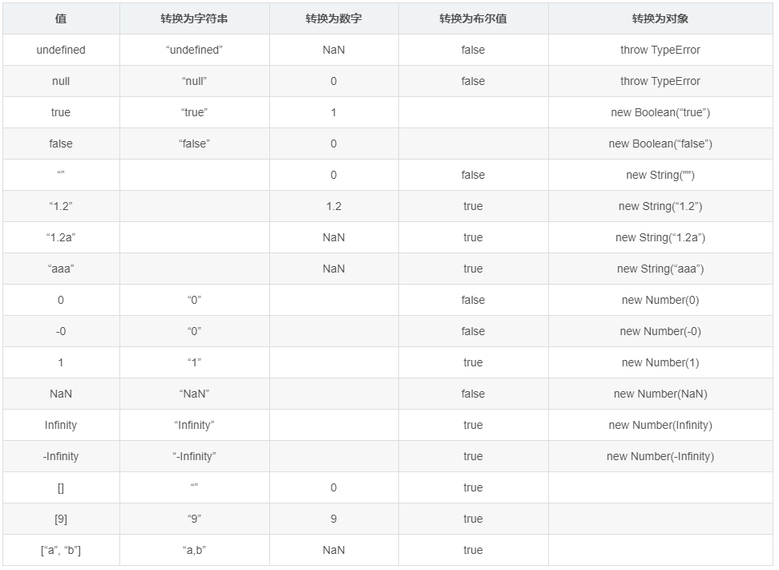

# JS隐式类型转换详解



## 运算符中的关系转换
以上只是一些原理的介绍，下面介绍运算符中的隐式类型转换。

**1.算数运算符**（+,-,*,/,++,--,% ...)
+ `+` 作为一个双目运算符： 若`+`两边存在一个字符串，将另一个也转为字符串进行字符串拼接。  
**两个对象相加**：规则是调用其 valueOf() 或 toString() 以取得一个非对象的值（primitive value）。如果两个值中的任何一个是字符串，则进行字符串串接，否则进行数字加法。
+ 其他情况下，不管双目还是单目，都转为数值类型

**2.关系运算符**（>、<、==、!=…）
+ ===、!==：同时对比类型和值，两个都为真才返回真
+ ==、!=: 若两边均为对象，对比它们的引用是否相同
+ 逻辑非(!): 将其后变量或表达式转为布尔值
+ 对比字符串：从头至尾扫描逐个比较每个字符的unicode码，直到分出大小
+ 其他情况下，两边均转为数值类型


```Bash
// [] 和 {} 的 valueOf() 都返回对象自身，所以都会调用 toString()，最后的结果是字符串串接。[].toString() 返回空字符串，({}).toString() 返回“[object Object]”。
{} + {} 		=>	 "[object Object][object Object]"
[1,2,3] + [] 	=>	 "1,2,3" + "" ->"1,2,3"
[] + {} 		=>	 "" + "[object Object]" -> "[object Object]"
{} + []		    =>	 0    ---> {}被当做一个块，相当于执行 ({},+[])，返回值为小括号最后面的表达式的返回值
{q:1} + [] 		=>	 0 ？？
1+true   => 2  
1+'true' => '1true'
1+undefined => NaN
1+null => 1  null->0

var a = {q:1};
a + []	 => "[object Object]"     变量形式运算正常
[] + a 	 => "[object Object]"

{} == []  => 报错   ({}, ==[])->报错
// !! 神坑
[] == 0   => true	[]->""->0
![] == 0  => true   ![]->false->0
//！！神坑
[] == ![] => true   []->""->0  ![]->false->0
[] == []  => false  比较引用地址
//！！神坑

{} == {}  => false  比较引用地址
{} == !{} => false  !{}->false->0  {}->"[object Object]"->NaN
NaN == NaN => false
undefined == undefined => true
undefined == null => true
null == null true


'2'>10 => false     '2'->2
'2'>'10' => true    '2'->'2'.charCodeAt()->50 '10'->'10'.charCodeAt()->49
"abc">"b" => false   ---> "a"和"b"直接比较 ,'a'->'a'.charCodeAt()->97 'b'->'b'.charCodeAt()->98
```
