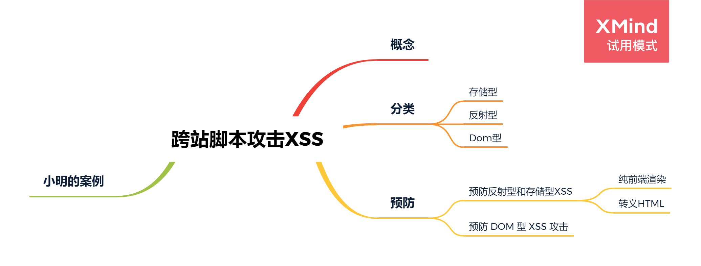
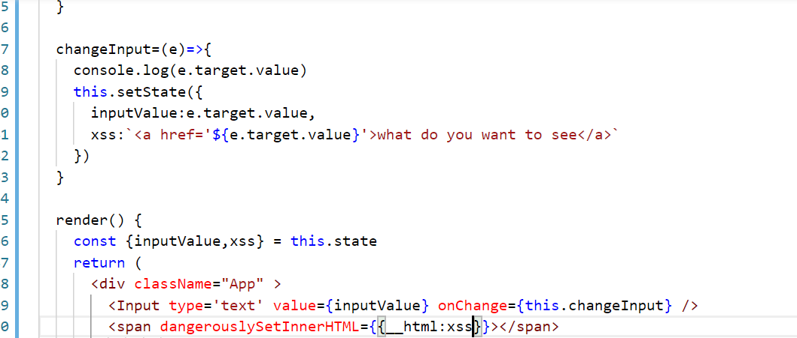
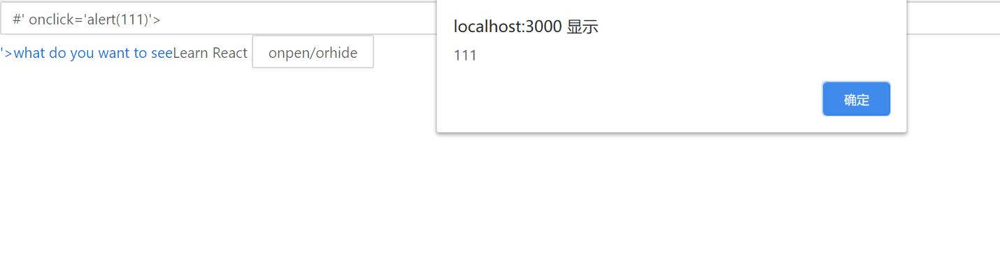

# 跨站脚本攻击XSS
<!-- @import "[TOC]" {cmd="toc" depthFrom=1 depthTo=6 orderedList=false} -->


## 概念
XSS跨站脚本（cross site script）为了避免与样式css混淆，所以简称为XSS。

<font color='orange'>XSS是指恶意攻击者利用网站没有对用户提交数据进行转义处理或者过滤不足的缺点，</font>在Web页面里插入恶意Script代码，当用户浏览该页之时，嵌入其中Web里面的Script代码会被执行，从而达到恶意攻击用户的目的

从而盗取用户资料、利用用户身份进行某种动作或者对访问者进行病毒侵害的一种攻击方式。

所以xss漏洞关键就是**寻找参数未过滤的输出函数。**

## XSS 分类
根据攻击的来源，XSS 攻击可分为存储型、反射型和 DOM 型三种。


类型|存储区|插入点|
-|-|-
存储型 XSS|后端数据库|HTML| 
反射型 XSS|URL|HTML| 
DOM 型 XSS|后端数据库/前端存储/URL|前端 JavaScript|

存储区：恶意代码存放的位置。  
插入点：由谁取得恶意代码，并插入到网页上。  

**存储型 XSS**  
存储型 XSS 的攻击步骤：

1.攻击者将恶意代码提交到目标网站的数据库中。  
2.用户打开目标网站时，网站服务端将恶意代码从数据库取出，拼接在 HTML 中返回给浏览器。  
3.用户浏览器接收到响应后解析执行，混在其中的恶意代码也被执行。  
4.恶意代码窃取用户数据并发送到攻击者的网站，或者冒充用户的行为，调用目标网站接口执行攻击者指定的操作。

这种攻击常见于带有用户保存数据的网站功能，如论坛发帖、商品评论、用户私信等。

**反射型 XSS**  
反射型 XSS 的攻击步骤：

1.攻击者构造出特殊的 URL，其中包含恶意代码。  
2.用户打开带有恶意代码的 URL 时，网站服务端将恶意代码从 URL 中取出，拼接在 HTML 中返回给浏览器。  
3.用户浏览器接收到响应后解析执行，混在其中的恶意代码也被执行。  
4.恶意代码窃取用户数据并发送到攻击者的网站，或者冒充用户的行为，调用目标网站接口执行攻击者指定的操作。  

<font color='blue'>反射型 XSS 跟存储型 XSS 的区别是</font>：存储型 XSS 的恶意代码存在数据库里，反射型 XSS 的恶意代码存在 URL 里。

反射型 XSS 漏洞常见于通过 URL 传递参数的功能，如网站搜索、跳转等。

由于需要用户主动打开恶意的 URL 才能生效，攻击者往往会结合多种手段诱导用户点击。

POST 的内容也可以触发反射型 XSS，只不过其触发条件比较苛刻（需要构造表单提交页面，并引导用户点击），所以非常少见。

**DOM 型 XSS**  
DOM 型 XSS 的攻击步骤：

1.攻击者构造出特殊的 URL，其中包含恶意代码。  
2.用户打开带有恶意代码的 URL。  
3.用户浏览器接收到响应后解析执行，前端 JavaScript 取出 URL 中的恶意代码并执行。  
4.恶意代码窃取用户数据并发送到攻击者的网站，或者冒充用户的行为，调用目标网站接口执行攻击者指定的操作。  

<font color='blue'>DOM 型 XSS 跟前两种 XSS 的区别</font>：DOM 型 XSS 攻击中，取出和执行恶意代码由浏览器端完成，属于前端 JavaScript 自身的安全漏洞，而其他两种 XSS 都属于服务端的安全漏洞。

## XSS攻击的防御
通过前面的介绍可以得知，XSS 攻击有两大要素：  
+ 攻击者提交恶意代码。  
+ 浏览器执行恶意代码。  

        针对第一个要素：我们是否能够在用户输入的过程，过滤掉用户<font color='orange'>输入</font>的恶意代码呢？

        输入过滤
        在用户提交时，由前端过滤输入，然后提交到后端。这样做是否可行呢？

        答案是不可行。一旦攻击者绕过前端过滤，直接构造请求，就可以提交恶意代码了。

        那么，换一个过滤时机：后端在写入数据库前，对输入进行过滤，然后把“安全的”内容，返回给前端。这样是否可行呢？

        我们举一个例子，一个正常的用户输入了 5 < 7 这个内容，在写入数据库前，被转义，变成了 `5 &lt; 7`。

        问题是：在提交阶段，我们并不确定内容要输出到哪里。

        这里的“并不确定内容要输出到哪里”有两层含义：

        用户的输入内容可能同时提供给前端和客户端，而一旦经过了 escapeHTML()，客户端显示的内容就变成了乱码( 5 `&lt;` 7 )。
        在前端中，不同的位置所需的编码也不同。

        当 5 &lt; 7 作为 HTML 拼接页面时，可以正常显示：
        ```
        <div title="comment">5 &lt; 7</div> 
        ```
        当 `5 &lt; 7` 通过 Ajax 返回，然后赋值给 JavaScript 的变量时，前端得到的字符串就是转义后的字符。这个内容不能直接用于 Vue 等模板的展示，也不能直接用于内容长度计算。不能用于标题、alert 等。  
        所以，输入侧过滤能够在某些情况下解决特定的 XSS 问题，但会引入很大的不确定性和乱码问题。在防范 XSS 攻击时应避免此类方法。

        当然，**对于明确的输入类型，例如数字、URL、电话号码、邮件地址等等内容，进行输入过滤**还是必要的。

既然输入过滤并非完全可靠，我们就要通过“防止浏览器执行恶意代码”来防范 XSS。这部分分为两类：

+ 防止 HTML 中出现注入。
+ 防止 JavaScript 执行时，执行恶意代码。

**预防存储型和反射型 XSS 攻击**  
存储型和反射型 XSS 都是在服务端取出恶意代码后，插入到响应 HTML 里的，攻击者刻意编写的“数据”被内嵌到“代码”中，被浏览器所执行。

预防这两种漏洞，有两种常见做法：

+ 改成纯前端渲染，把代码和数据分隔开。  
+ 对 HTML 做充分转义。  

**1.纯前端渲染**  
纯前端渲染的过程：

1）浏览器先加载一个静态 HTML，此 HTML 中不包含任何跟业务相关的数据。  
2）然后浏览器执行 HTML 中的 JavaScript。  
3）JavaScript 通过 Ajax 加载业务数据，调用 DOM API 更新到页面上。

在纯前端渲染中，我们会明确的告诉浏览器：下面要设置的内容是文本（.innerText），还是属性（.setAttribute），还是样式（.style）等等。浏览器不会被轻易的被欺骗，执行预期外的代码了。

但纯前端渲染还需注意避免 DOM 型 XSS 漏洞（例如 onload 事件和 href 中的 javascript:xxx 等，请参考下文”预防 DOM 型 XSS 攻击“部分）。

在很多内部、管理系统中，采用纯前端渲染是非常合适的。但对于性能要求高，或有 SEO 需求的页面，我们仍然要面对拼接 HTML 的问题。

**2.转义 HTML**  
如果拼接 HTML 是必要的，就需要采用合适的转义库，对 HTML 模板各处插入点进行充分的转义。

常用的模板引擎，如 doT.js、ejs、FreeMarker 等，对于 HTML 转义通常只有一个规则，就是把 `& < > " ' / `这几个字符转义掉，确实能起到一定的 XSS 防护作用，但并不完善：

|XSS 安全漏洞|简单转义是否有防护作用| 
-|-
|HTML 标签文字内容|有| 
|HTML 属性值|有| 
|CSS 内联样式|无| 
|内联 JavaScript|无|
|内联 JSON|无|
|跳转链接|无|

所以要完善 XSS 防护措施，我们要使用更完善更细致的转义策略。

**预防 DOM 型 XSS 攻击**  
DOM 型 XSS 攻击，实际上就是网站前端 JavaScript 代码本身不够严谨，把不可信的数据当作代码执行了。

在使用` .innerHTML、.outerHTML、document.write()` 时要特别小心，不要把不可信的数据作为 HTML 插到页面上，而应尽量使用 `.textContent、.setAttribute()` 等。

如果用 Vue/React 技术栈，并且不使用` v-html/dangerouslySetInnerHTML `功能，就在前端 render 阶段避免 innerHTML、outerHTML 的 XSS 隐患。

DOM 中的内联事件监听器，如 `location、onclick、onerror、onload、onmouseover` 等，`<a>` 标签的 `href` 属性，JavaScript 的 `eval()、setTimeout()、setInterval()` 等，都能把字符串作为代码运行。如果不可信的数据拼接到字符串中传递给这些 API，很容易产生安全隐患，请务必避免。
```bash
<!-- 内联事件监听器中包含恶意代码 -->


<!-- 链接内包含恶意代码 -->
<a href="UNTRUSTED">1</a>

<script>
// setTimeout()/setInterval() 中调用恶意代码
setTimeout("UNTRUSTED")
setInterval("UNTRUSTED")

// location 调用恶意代码
location.href = 'UNTRUSTED'

// eval() 中调用恶意代码
eval("UNTRUSTED")
</script>
```
如果项目中有用到这些的话，一定要避免在字符串中拼接不可信数据。


## XSS攻击出现场景
**反射型XSS：**
某天，公司需要一个搜索页面，根据 URL 参数决定关键词的内容。小明很快把页面写好并且上线。代码如下：
```
<input type="text" value="<%= getParameter("keyword") %>">
<button>搜索</button>
<div>
  您搜索的关键词是：<%= getParameter("keyword") %>
</div>
```
然而，在上线后不久，小明就接到了安全组发来的一个神秘链接：
```
http://xxx/search?keyword="><script>alert('XSS');</script>
```
小明带着一种不祥的预感点开了这个链接[请勿模仿，确认安全的链接才能点开]。果然，页面中弹出了写着”XSS”的对话框。

可恶，中招了！小明眉头一皱，发现了其中的奥秘：

当浏览器请求 `http://xxx/search?keyword="><script>alert('XSS');</script> `时，服务端会解析出请求参数 keyword，得到 "><script>alert('XSS');</script>，拼接到 HTML 中返回给浏览器。形成了如下的 HTML：
```bash
<input type="text" value=""><script>alert('XSS');</script>">
<button>搜索</button>
<div>
  您搜索的关键词是："><script>alert('XSS');</script>
</div>
```
浏览器无法分辨出`<script>alert('XSS');</script>` 是恶意代码，因而将其执行。

这里不仅仅 div 的内容被注入了，而且 input 的 value 属性也被注入， alert 会弹出两次。

面对这种情况，我们应该如何进行防范呢？

其实，这只是浏览器把用户的输入当成了脚本进行了执行。那么只要告诉浏览器这段内容是文本就可以了。

聪明的小明很快找到解决方法，把这个漏洞修复：
```
<input type="text" value="<%= escapeHTML(getParameter("keyword")) %>">
<button>搜索</button>
<div>
  您搜索的关键词是：<%= escapeHTML(getParameter("keyword")) %>
</div>
```
escapeHTML() 按照如下规则进行转义：

字符|转义后的字符|
-|-
 |&|`&amp;`|
 |<|`&lt;`| 
 |>|`&gt;`|
 |"|`&quot;`|
 |'|`&#x27;`|
 |/|`&#x2F;`|

经过了转义函数的处理后，最终浏览器接收到的响应为：
```
<input type="text" value="&quot;&gt;&lt;script&gt;alert(&#x27;XSS&#x27;);&lt;&#x2F;script&gt;">
<button>搜索</button>
<div>
  您搜索的关键词是：&quot;&gt;&lt;script&gt;alert(&#x27;XSS&#x27;);&lt;&#x2F;script&gt;
</div>
```
恶意代码都被转义，不再被浏览器执行，而且搜索词能够完美的在页面显示出来。   
通过这个事件，小明学习到了如下知识：

+ 通常页面中包含的用户输入内容都在固定的容器或者属性内，以文本的形式展示。
+ 攻击者利用这些页面的用户输入片段，拼接特殊格式的字符串，突破原有位置的限制，形成了代码片段。
+ 攻击者通过在目标网站上注入脚本，使之在用户的浏览器上运行，从而引发潜在风险。
+ 通过 HTML 转义，可以防止 XSS 攻击。[事情当然没有这么简单啦！请继续往下看]。

### 注意特殊的 HTML 属性、JavaScript API
自从上次事件之后，小明会小心的把插入到页面中的数据进行转义。而且他还发现了大部分模板都带有的转义配置，让所有插入到页面中的数据都默认进行转义。这样就不怕不小心漏掉未转义的变量啦，于是小明的工作又渐渐变得轻松起来。

但是，作为导演的我，不可能让小明这么简单、开心地改 Bug 。

不久，小明又收到安全组的神秘链接：`http://xxx/?redirect_to=javascript:alert('XSS')`。小明不敢大意，赶忙点开页面。然而，页面并没有自动弹出万恶的“XSS”。

小明打开对应页面的源码，发现有以下内容：
`
<a href="<%= escapeHTML(getParameter("redirect_to")) %>">跳转...</a>`
这段代码，当攻击 URL 为 `http://xxx/?redirect_to=javascript:alert('XSS')`，服务端响应就成了：
`
<a href="javascript:alert(&#x27;XSS&#x27;)">跳转...</a>
·
虽然代码不会立即执行，但一旦用户点击 a 标签时，浏览器会就会弹出“XSS”。

>可恶，又失策了…

在这里，用户的数据并没有在位置上突破我们的限制，仍然是正确的 href 属性。但其内容并不是我们所预期的类型。

原来不仅仅是特殊字符，连 javascript: 这样的字符串如果出现在特定的位置也会引发 XSS 攻击。

小明眉头一皱，想到了解决办法：
```
// 禁止 URL 以 "javascript:" 开头
xss = getParameter("redirect_to").startsWith('javascript:');
if (!xss) {
  <a href="<%= escapeHTML(getParameter("redirect_to"))%>">
    跳转...
  </a>
} else {
  <a href="/404">
    跳转...
  </a>
}
```
只要 URL 的开头不是 javascript:，就安全了吧？

安全组随手又扔了一个连接：`http://xxx/?redirect_to=jAvascRipt:alert('XSS')`

>这也能执行？…..好吧，浏览器就是这么强大。

小明欲哭无泪，在判断 URL 开头是否为 javascript: 时，先把用户输入转成了小写，然后再进行比对。

不过，所谓“道高一尺，魔高一丈”。面对小明的防护策略，安全组就构造了这样一个连接：
```
http://xxx/?redirect_to=%20javascript:alert('XSS')
```
`%20javascript:alert('XSS')` 经过 URL 解析后变成 `javascript:alert('XSS')`，这个字符串以空格开头。这样攻击者可以绕过后端的关键词规则，又成功的完成了注入。

最终，小明选择了白名单的方法，彻底解决了这个漏洞：
```
// 根据项目情况进行过滤，禁止掉 "javascript:" 链接、非法 scheme 等
allowSchemes = ["http", "https"];

valid = isValid(getParameter("redirect_to"), allowSchemes);

if (valid) {
  <a href="<%= escapeHTML(getParameter("redirect_to"))%>">
    跳转...
  </a>
} else {
  <a href="/404">
    跳转...
  </a>
}
```
通过这个事件，小明学习到了如下知识：

+ 做了 HTML 转义，并不等于高枕无忧。
+ 对于链接跳转，如 <a href="xxx" 或 location.href="xxx"，要检验其内容，禁止以 javascript: 开头的链接，和其他非法的 scheme。
### 根据上下文采用不同的转义规则
某天，小明为了加快网页的加载速度，把一个数据通过 JSON 的方式内联到 HTML 中：
```
<script>
var initData = <%= data.toJSON() %>
</script>
```
插入 JSON 的地方不能使用 escapeHTML()，因为转义 " 后，JSON 格式会被破坏。

但安全组又发现有漏洞，原来这样内联 JSON 也是不安全的：

+ 当 JSON 中包含 U+2028 或 U+2029 这两个字符时，不能作为 JavaScript 的字面量使用，否则会抛出语法错误。
+ 当 JSON 中包含字符串 `</script> `时，当前的 script 标签将会被闭合，后面的字符串内容浏览器会按照 HTML 进行解析；通过增加下一个 `<script> `标签等方法就可以完成注入。
于是我们又要实现一个 escapeEmbedJSON() 函数，对内联 JSON 进行转义。

转义规则如下：

|字符|转义后的字符| 
-|-
 |U+2028|\u2028| 
 |U+2029|\u2029| 
 |<|\u003c|

修复后的代码如下：
```
<script>
var initData = <%= escapeEmbedJSON(data.toJSON()) %>
```
通过这个事件，小明学习到了如下知识：

+ HTML 转义是非常复杂的，在不同的情况下要采用不同的转义规则。如果采用了错误的转义规则，很有可能会埋下 XSS 隐患。
+ 应当尽量避免自己写转义库，而应当采用成熟的、业界通用的转义库。

**漏洞总结**  
小明的例子讲完了，下面我们来系统的看下 XSS 有哪些注入的方法：

+ 在 HTML 中内嵌的文本中，恶意内容以 script 标签形成注入。
+ 在内联的 JavaScript 中，拼接的数据突破了原本的限制（字符串，变量，方法名等）。
+ 在标签属性中，恶意内容包含引号，从而突破属性值的限制，注入其他属性或者标签。
+ 在标签的 href、src 等属性中，包含 javascript: 等可执行代码。
+ 在 onload、onerror、onclick 等事件中，注入不受控制代码。
+ 在 style 属性和标签中，包含类似 background-image:url("javascript:..."); 的代码（新版本浏览器已经可以防范）。
+ 在 style 属性和标签中，包含类似 expression(...) 的 CSS 表达式代码（新版本浏览器已经可以防范）。


总之，如果开发者没有将用户输入的文本进行合适的过滤，就贸然插入到 HTML 中，这很容易造成注入漏洞。攻击者可以利用漏洞，构造出恶意的代码指令，进而利用恶意代码危害数据安全。

**DOM型xss**  


比如下这样一段react代码(react是由html转义的，但当使用dangerouslySetInnerHTML时就用可能出现XSS。未使用是{}中的会转换为字符串输出。)


当在input标签中输入 `#' onclick='alert(111)>,点击what do you want to see 就会弹出‘111’，这情况下就是一种Dom型的XSS


转载自：[美团团队](https://tech.meituan.com/2018/09/27/fe-security.html)

