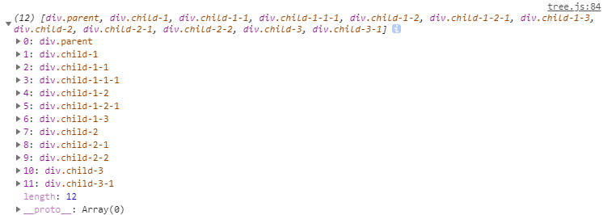

我将用深度优先遍历和广度优先遍历对这个dom树进行查找

## 深度优先遍历  DFS (depth first search )
  类似树的先序遍历——根左右，有两种方式：递归和循环。其中循环的话使用栈：先进后出。

```javascript
/*深度优先遍历两种方式*/
/*递归*/
let deepTraversal1 = (node, nodeList = []) => {
  if (node !== null) {
    nodeList.push(node)
    let children = node.children
    for (let i = 0; i < children.length; i++) {
      deepTraversal1(children[i], nodeList)
    }
  }
  return nodeList
}
/*循环*/
let deepTraversal3 = (node) => {
  let stack = [] // 用于过程中存储循环节点
  let results = [] // 用于最后结果的存储
  if (node) {
    // 推入当前处理的node
    stack.push(node)
    while (stack.length) {
      let item = stack.pop()
      let children = item.children
      results.push(item)
      for (let i = children.length - 1; i >= 0; i--) {
        stack.push(children[i])
      }
    }
  }
  return results
}
```
结果：
  


  ## 深度优先遍历  BFS 
循环的使用队列：先进先出。
```javascript
let widthTraversal2 = (node) => {
  let results = []
  let queue = []
  if (node) {
    queue.push(node)
    while (queue.length) {
      let item = queue.shift()
      let children = item.children
      results.push(item)
        // 队列，先进先出
        // results = [] queue = [parent]
        // results = [parent] queue = [child1,child2,child3]
        // results = [parent, child1] queue = [child2,child3,child1-1,child1-2]
        // results = [parent,child1,child2]
      for (let i = 0; i < children.length; i++) {
        queue.push(children[i])
      }
    }
  }
  return results
}
```

[原文链接](https://github.com/Advanced-Frontend/Daily-Interview-Question/issues/9)