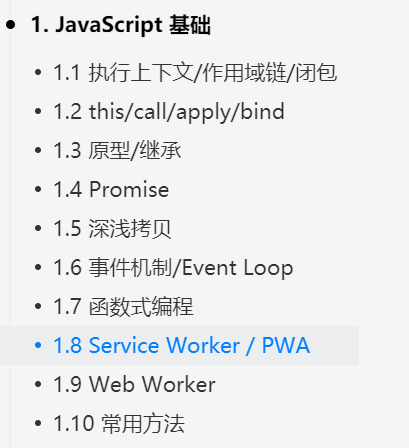

# [2020年前端面试复习必读文章【超三百篇文章/赠复习导图】](https://juejin.im/post/6844904116339261447#heading-3)

# js基础

1.1 执行上下文/作用域链/闭包  
   /知识碎片（前端基础）/js执行上下文

1.2 this/call/apply/bind  
+ [JavaScript深入之call和apply的模拟实现](https://juejin.im/post/6844903476477034510)

+ [不用call和apply方法模拟实现ES5的bind方法](https://juejin.im/post/6844903476623835149)

1.3 原型/继承  
+ [原型](https://www.cnblogs.com/loveyaxin/p/11151586.html) 
+ [继承]()   **???**  
  + [继承的实现](http://louiszhai.github.io/2015/12/15/prototypeChain/)
  +  [ES5/ES6 的继承除了写法以外还有什么区别？](https://github.com/Advanced-Frontend/Daily-Interview-Question/issues/20)

1.4 Promise
+ [手撕promise](https://juejin.im/post/6844903625769091079#heading-9)

1.5 深浅拷贝
+ [深拷贝](https://github.com/yygmind/blog/issues/29)

1.6 事件机制/Event Loop  
 知识碎片（前端基础）/浏览器/浏览器事件循环和node事件循环的区别.md

 # webapck
 1. [webpack构建流程](https://www.jianshu.com/p/5ded519fc1e7)

2. [webpack热更新](https://github.com/advanced-frontend/daily-interview-question/issues/118)  
  + 当修改了一个或多个文件；  
  + 文件系统接收更改并通知webpack；  
  + webpack重新编译构建一个或多个模块，并通知HMR服务器进行更新；  
  + HMR Server 使用webSocket通知HMR runtime 需要更新，HMR运行时通过HTTP请求更新jsonp；  
  + HMR运行时替换更新中的模块，如果确定这些模块无法更新，则触发整个页面刷新。  

3. [动态链接库DLL](https://www.cnblogs.com/skychx/p/webpack-dllplugin.html)

4. [webpack的tree-shaking](https://juejin.cn/post/6844903544756109319)

5. [webpack的scope hoist](https://segmentfault.com/a/1190000012600832)

6. [webpack的代码分割](https://zhuanlan.zhihu.com/p/26710831)