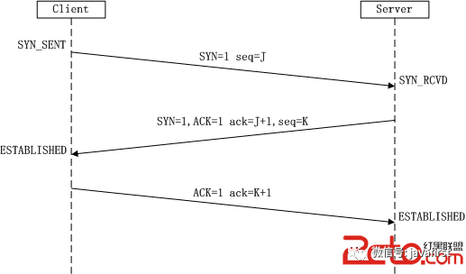
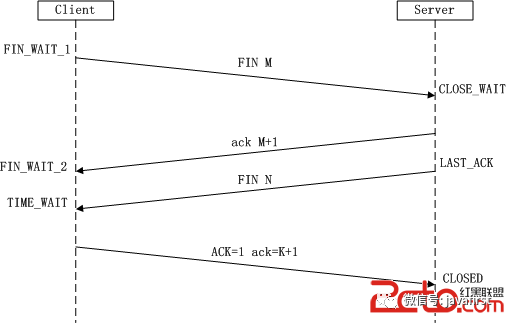

+ 从URL到页面展现发生了什么
+ TCP三次握手
+ TCP为什么要三次握手
+ 断开连接时TCP四次握手
+ TCP握手的原因
+ HTTP的缺点与HTTPS
+ HTTP请求报文与响应报文格式
+ 介绍https握手过程

# 从URL到页面展现发生了什么
+ 域名（DNS）解析：将域名解析成Ip地址
+ TCP链接：TCP三次握手
+ 发起http请求
+ 服务器处理请求，并响应
+ 浏览器渲染页面
+ 断开连接：tcp四次握手

# TCP三次握手
**第一次握手**：客户端A将标志位SYN置为1,随机产生一个值为seq=J（J的取值范围为=1234567）的数据包到服务器，客户端A进入SYN_SENT状态，等待服务端B确认；

**第二次握手**：服务端B收到数据包后由标志位SYN=1知道客户端A请求建立连接，服务端B将标志位SYN和ACK都置为1，ack=J+1，随机产生一个值seq=K，并将该数据包发送给客户端A以确认连接请求，服务端B进入SYN_RCVD状态。

**第三次握手**：客户端A收到确认后，检查ack是否为J+1，ACK是否为1，如果正确则将标志位ACK置为1，ack=K+1，并将该数据包发送给服务端B，服务端B检查ack是否为K+1，ACK是否为1，如果正确则连接建立成功，客户端A和服务端B进入ESTABLISHED状态，完成三次握手，随后客户端A与服务端B之间可以开始传输数据了。

如图所示：

# 为什需要三次握手？

《计算机网络》第四版中讲“三次握手”的目的是“**为了防止已失效的连接请求报文段突然又传送到了服务端，因而产生错误**”

 书中的例子是这样的，“已失效的连接请求报文段”的产生在这样一种情况下：client发出的第一个连接请求报文段并没有丢失，而是在某个网络结点长时间的滞留了，以致延误到连接释放以后的某个时间才到达server。本来这是一个早已失效的报文段。但server收到此失效的连接请求报文段后，就误认为是client再次发出的一个新的连接请求。于是就向client发出确认报文段，同意建立连接

假设不采用“三次握手”，那么只要server发出确认，新的连接就建立了。由于现在client并没有发出建立连接的请求，因此不会理睬server的确认，也不会向server发送数据。但server却以为新的运输连接已经建立，并一直等待client发来数据。这样，server的很多资源就白白浪费掉了。采用“三次握手”的办法可以防止上述现象发生。例如刚才那种情况，client不会向server的确认发出确认。server由于收不到确认，就知道client并没有要求建立连接。”。主要目的防止server端一直等待，浪费资源。

# TCP四次挥手

**第一次挥手**：Client发送一个FIN，用来关闭Client到Server的数据传送，Client进入FIN_WAIT_1状态。

**第二次挥手**：Server收到FIN后，发送一个ACK给Client，确认序号为收到序号+1（与SYN相同，一个FIN占用一个序号），Server进入CLOSE_WAIT状态。

**第三次挥手**：Server发送一个FIN，用来关闭Server到Client的数据传送，Server进入LAST_ACK状态。

**第四次挥手**：Client收到FIN后，Client进入TIME_WAIT状态，接着发送一个ACK给Server，确认序号为收到序号+1，Server进入CLOSED状态，完成四次挥手。

# 为什么建立连接是三次握手，而关闭连接却是四次挥手呢？

这是因为服务端在LISTEN状态下，收到建立连接请求的SYN报文后，把ACK和SYN放在一个报文里发送给客户端。而关闭连接时，当收到对方的FIN报文时，仅仅表示对方不再发送数据了但是还能接收数据，服务器端也未必全部数据都发送给对方了，所以服务器端可以立即close，也可以发送一些数据给对方后，再发送FIN报文给对方来表示同意现在关闭连接，因此，己方ACK和FIN一般都会分开发送。

# HTTP的缺点与HTTPS
a、通信使用明文不加密，内容可能被窃听
b、不验证通信方身份，可能遭到伪装
c、无法验证报文完整性，可能被篡改
HTTPS就是HTTP加上加密处理（一般是SSL安全通信线路）+认证+完整性保护

# HTTP请求报文与响应报文格式
请求报文包含三部分：
a、请求行：包含请求方法、URI、HTTP版本信息
b、请求首部字段
c、请求内容实体
响应报文包含三部分：
a、状态行：包含HTTP版本、状态码、状态码的原因短语
b、响应首部字段
c、响应内容实体

# 介绍https握手过程
1. 客户端使用https的url访问web服务器,要求与服务器建立ssl连接
2. web服务器收到客户端请求后, 会将网站的证书(包含公钥)传送一份给客户端
3. 客户端收到网站证书后会检查证书的颁发机构以及过期时间, 如果没有问题就随机产生一个秘钥
4. 客户端利用公钥将会话秘钥加密, 并传送给服务端, 服务端利用自己的私钥解密出会话秘钥
5. 之后服务器与客户端使用秘钥加密传输

# 中间人攻击
非对称加密,使用公钥/私钥加解密:
1. 服务器端发起通信并携带自己的公钥，客户端通过公钥来加密对称秘钥；
2. 然后发送给发起方服务器端；服务器端通过私钥解密；
3. 双发接下来通过对称秘钥来进行加密通信；

但是这种方式还是会存在一种安全性；中间人虽然不知道发起方服务器端的私钥，但是可以做到偷天换日，将拦截发起方的公钥key;并将自己生成的一对公/私钥的公钥发送给客户端；客户端并不知道公钥已经被偷偷换过；按照之前的流程，客户端通过公钥加密自己生成的对称加密秘钥key2;发送给服务器端；

这次通信再次被中间人拦截，尽管后面的通信，两者还是用key2通信，但是中间人已经掌握了Key2;可以进行轻松的加解密；还是存在被中间人攻击风险；

# HTTPS 握手过程中，客户端如何验证证书的合法性 

1. 制作证书：作为服务端的A，首先把自己的公钥key1发给证书颁发机构，向证书颁发机构进行申请证书；证书颁发机构有一套自己的公私钥，CA通过自己的私钥来加密key1,并且通过服务端网址等信息生成一个证书签名，证书签名同样使用机构的私钥进行加密；制作完成后，机构将证书发给A；

2. 校验证书真伪：当客户端B向服务端A发起请求通信的时候，A不再直接返回自己的公钥，而是返回一个证书；
说明：各大浏览器和操作系统已经维护了所有的权威证书机构的名称和公钥。客户端B只需要知道是哪个权威机构发的证书，使用对应的机构公钥，就可以解密出证书签名；接下来，客户端B使用同样的规则，生成自己的证书签名，如果两个签名是一致的，说明证书是有效的；
签名验证成功后，客户端B就可以再次利用机构的公钥，解密出A的公钥key1;接下来的操作，就是和之前一样的流程了；

# 简单讲解一下 http2 的多路复用 
HTTP2采用二进制格式传输，取代了HTTP1.x的文本格式，二进制格式解析更高效。
多路复用代替了HTTP1.x的序列和阻塞机制，所有的相同域名请求都通过同一个TCP连接并发完成。在HTTP1.x中，并发多个请求需要多个TCP连接，浏览器为了控制资源会有6-8个TCP连接都限制。
HTTP2中
+ **同域名下所有通信都在单个连接上完成，消除了因多个 TCP 连接而带来的延时和内存消耗**
+ 单个连接上可以并行交错的请求和响应，之间互不干扰