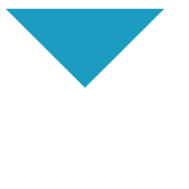

# css前端面试3+1
>这是一个答案总结，选自回答里我觉得比较好的答案，再动手验证，以驱动自己学习，方便自己复习.答案来自于回答者 [github](https://github.com/haizlin/fe-interview/issues/2)
## 第1天 圣杯布局和双飞翼布局的理解和区别，并用代码实现


+ 作用：圣杯布局和双飞翼布局解决的问题是一样的，就是两边顶宽，中间自适应的三栏布局，中间栏要在放在文档流前面以优先渲染。

+ 区别：圣杯布局，为了中间div内容不被遮挡，将中间div设置了左右padding-left和padding-right后，将左右两个div用相对布局position: relative并分别配合right和left属性，以便左右两栏div移动后不遮挡中间div。双飞翼布局，为了中间div内容不被遮挡，直接在中间div内部创建子div用于放置内容，在该子div里用margin-left和margin-right为左右两栏div留出位置。

***圣杯布局***
```C
<body>
<div id="hd">header</div>
<div id="bd">
  <div id="middle">middle</div>
  <div id="left">left</div>
  <div id="right">right</div>
</div>
<div id="footer">footer</div>
</body>

<style>
#hd{
    height:50px;
    background: #666;
    text-align: center;
}
#bd{
    /*左右栏通过添加负的margin放到正确的位置了，此段代码是为了摆正中间栏的位置*/
    padding:0 200px 0 180px;
    height:100px;
}
#middle{
    float:left;
    width:100%;/*左栏上去到第一行*/
    height:100px;
    background:blue;
}
#left{
    float:left;
    width:180px;
    height:100px;
    margin-left:-100%;
    /*元素左边框相对于父元素右边框的距离（忽略padding和border），也就是相对向左移动一个父元素的距离*/
    background:#0c9;
    /*中间栏的位置摆正之后，左栏的位置也相应右移，通过相对定位的left恢复到正确位置*/
    position:relative;//为middle腾出位置
    left:-180px;
}
#right{
    float:left;
    width:200px;
    height:100px;
    margin-left:-200px;
    background:#0c9;
    /*中间栏的位置摆正之后，右栏的位置也相应左移，通过相对定位的right恢复到正确位置*/
    position:relative;
    right:-200px;
}
#footer{
    height:50px;
    background: #666;
    text-align: center;
}
</style>
```
***双飞翼布局***

```C
<body>
<div id="hd">header</div>
  <div id="middle">
    <div id="inside">middle</div>
  </div>
  <div id="left">left</div>
  <div id="right">right</div>
  <div id="footer">footer</div>
</body>

<style>
#hd{
    height:50px;
    background: #666;
    text-align: center;
}
#middle{
    float:left;
    width:100%;/*左栏上去到第一行*/     
    height:100px;
    background:blue;
}
#left{
    float:left;
    width:180px;
    height:100px;
    margin-left:-100%;
    background:#0c9;
}
#right{
    float:left;
    width:200px;
    height:100px;
    margin-left:-200px;
    background:#0c9;
}

/*给内部div添加margin，把内容放到中间栏，其实整个背景还是100%*/
#inside{
    margin:0 200px 0 180px;
    height:100px;
}
#footer{  
   clear:both; /*记得清楚浮动*/  
   height:50px;     
   background: #666;    
   text-align: center;
}
</style>
```


---

## 第2天 CSS3有哪些新增的特性？


边框(borders):  
border-radius 圆角  
box-shadow 盒阴影  
border-image 边框图像

背景:  
background-size 背景图片的尺寸  
background_origin 背景图片的定位区域  
background-clip 背景图片的绘制区域  

渐变：  
linear-gradient 线性渐变  
radial-gradient 径向渐变  

文本效果;  
word-break  
word-wrap  
text-overflow  
text-shadow  
text-wrap  
text-outline  
text-justify  

转换：  

2D转换属性  
transform  
transform-origin  

2D转换方法  

translate(x,y)  
translateX(n)  
translateY(n)  
rotate(angle)  
scale(n)  
scaleX(n)   
scaleY(n)  
rotate(angle)  
matrix(n,n,n,n,n,n)  

3D转换：

3D转换属性：

transform  
transform-origin  
transform-style  

3D转换方法  
translate3d(x,y,z)  
translateX(x)  
translateY(y)  
translateZ(z)  
scale3d(x,y,z)  
scaleX(x)  
scaleY(y)  
scaleZ(z)  
rotate3d(x,y,z,angle)  
rotateX(x)  
rotateY(y)  
rotateZ(z)  
perspective(n)  

过渡  
transition

动画  
@Keyframes规则  
animation

弹性盒子(flexbox)

多媒体查询@media

---

## 第3天 在页面上隐藏元素的方法有哪些？并简述出第一种方法的应用场景和优劣势。

**占位**  
visibility:hidden;  
opacity:0;  
transform:sacle(0)  
margin-left:-100%

**不占位**  
display:none;  
width:0;height:0;overflow:hidden;

**仅对块内文本元素:**  
text-indent: -9999px;  
font-size: 0;

---

## 第4天 CSS选择器有哪些？哪些属性可以继承？

**选择器**  
+ 通配符  
+ class  
+ id  
+ 标签选择器  
+ 后代选择器  （>）  
+ 兄弟选择器 :（+）相邻兄弟选择器 （~）兄弟选择器
+ 属性选择器： input[type='text']  
+ 伪类选择器   :hover :active :first-child
+ 伪元素选择器  ::after

**可以继承的属性**
+ font-size
+ font-family
+ font-weight  
+ font-style
+ color

---

## 第5天 CSS3新增伪类有哪些并简要描述


---

## 第6天 用css创建一个三角形，并简述原理

```C
<div class='rect'></div>
<style>
    .rect {
      width: 0;
      height: 0;
      background-color: #fff;
      border-right: 100px solid rgb(34, 230, 220);
      border-left: 100px solid rgb(202, 146, 25);
      border-top: 100px solid rgb(29, 156, 194);
      border-bottom: 100px solid rgb(16, 204, 101);
    }
  </style>
```


创建一个div，宽高都为0，实现效果如下，发现border的四个边都是一个三角形，要实现三角形只需将其中几个边background设置为transparent，即可得到三角形

```C
<style>
  .rect {
    width: 0;
    height: 0;
    background-color: #fff;
    border-right: 100px solid transparent;
    border-left: 100px solid transparent;
    border-top: 100px solid rgb(29, 156, 194);
    border-bottom: 100px solid transparent;
  }
</style>
```


---
## 第7天 简述你对BFC规范的理解

[读张鑫旭有感](https://www.zhangxinxu.com/wordpress/2015/02/css-deep-understand-flow-bfc-column-two-auto-layout/)

**什么是BFC？**  
BFC全称”Block Formatting Context”, 中文为“块级格式化上下文”。(BFC元素特性表现原则就是，内部子元素再怎么翻江倒海，翻云覆雨都不会影响外部的元素。)  

**如何触发BFC？**  
+ float的值不为none。  
+ overflow的值为auto,scroll或hidden。  
+ display的值为table-cell, table-caption,  inline-block，**flow-root** 中的任何一个。  
+ position的值不为relative和static。

**触发BFC实现多栏自适应布局**==> 参考张鑫旭网站


---

## 第8天 清除浮动的方式有哪些及优缺点？

**问题出现的原因**  
父元素只包含浮动元素，那么它的高度就会塌缩为零（前提就是你们没有设置高度（height）属性，或者设置了为auto，就会出现这种情况，如果父元素不包含任何的可见背景，这个问题会很难被注意到。  
因为子元素设置了float属性，而float属性会把元素从标准文档流中抽离，直接结果就是外部盒子丢了两个孩子，因为内部没有其它盒子了，所以外部盒子只包裹文本节点内容，却把两个内部盒子扔在外面了

**解决方案**

1.上面分析了问题出现的原因，不难找到第一种解决方案（既然孩子丢了，那就去找呗）——给外部盒子也添加浮动  
把外部盒子也从标准文档流中抽离，让它和孩子们见面。  
**缺点**：可读性差，不易于维护（别人很难理解为什么要给父元素也添上float），而且可能需要调整整个页面布局。

2.在外部盒子内最下方添上带clear属性的空盒子  
可以是div也可以是其它块级元素，把`<div style="clear:both;"></div>`放在盒内底部，用最下面的空盒子清除浮动，把盒子重新撑起来。  
**缺点**：引入了冗余元素

3.用overflow:hidden清除浮动  
给外部盒子添上这个属性就好了，非常简单。  
**缺点**：有可能造成溢出元素不可见，影响展示效果。

4.用after伪元素清除浮动  
给外部盒子的after伪元素设置clear属性，再隐藏它  
这其实是对空盒子方案的改进，一种纯CSS的解决方案，不用引入冗余元素。

```
.clearfix {*zoom: 1;}
.clearfix:before,.clearfix:after {display: table;line-height: 0;content: "";}
.clearfix:after {clear: both;}
```
这也是bootstrap框架采用的清除浮动的方法。
