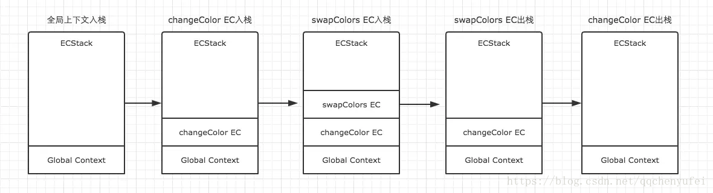
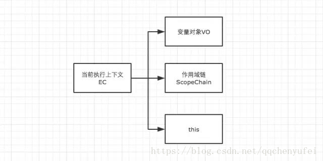
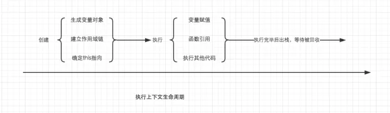
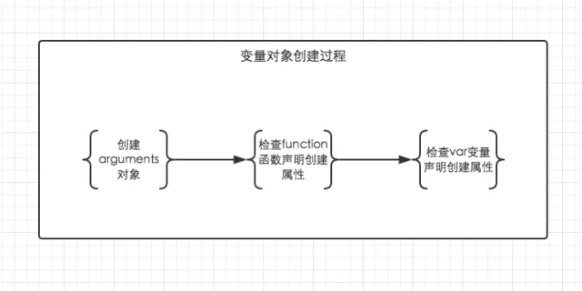
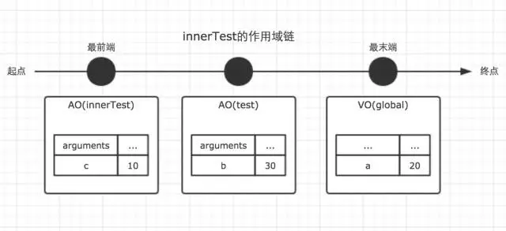
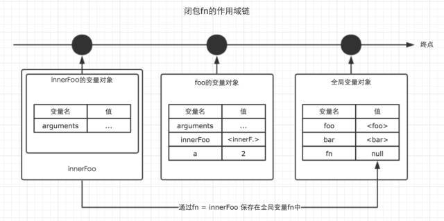

## 1、内存空间

内存空间大家都比较熟，即栈与堆。
JS的基础数据类型有`Undefined、Null、Boolean、Number、String`，这些都是按值访问，存放在**栈内存**。  
其他的`Object`为引用类型，如数组Array或其他的自定义对象，这些存放在**堆内存**，其对应的地址引用（指针）放在栈内存。


## 2、[JS代码的执行环境（执行上下文，Execution Context，下面简称EC）]( http://mp.weixin.qq.com/s/hRE3HzeSxxok1bLI8vH1yw)

执行上下文可以理解为当前代码的执行环境，它会形成一个作用域。JavaScript中的运行环境大概包括三种情况。

+ 全局环境：JavaScript代码运行起来会首先进入该环境

+ 函数环境：当函数被调用执行时，会进入当前函数中执行代码

+ eval

JS是单线程的，运行在全局`EC`，每进入一个`function`，就做一次入栈操作，向栈顶压入一个属于该`function`的新的`EC`。若`function`中又调用了另一个`function`，则再执行一次入栈…依次执行完再依次出栈，回到全局`EC`。全局`EC`一定是在栈底，在浏览器关闭后出栈。

因此在一个`JavaScript`程序中，必定会产生多个执行上下文，上面提到过`JavaScript`引擎会以堆栈的方式来处理它们，这个堆栈，我们称其为**函数调用栈(`call stack`)**。栈底永远都是全局上下文，而栈顶就是当前正在执行的上下文。

结合以下例子和图示来展示这个过程：
```bash
var color = 'blue';
function changeColor() {
    var anotherColor = 'red';
    function swapColors() {
        var tempColor = anotherColor;
        anotherColor = color;
        color = tempColor;
    }
    swapColors();
}
changeColor();
```


执行上下文，出入栈图解：


EC的构成如下图：


**变量对象**`VO（Variable Object）`保存此`EC`中涉及到的变量。  
**作用域链**保存着此`EC`中的`VO`与其他`EC`中的`VO`的关联关系（能否访问到）。  
然后是**this**，在`EC`被创建时，会确定`this`的指向。

EC的创建过程可以用以下代码表示：
```bash
		testEC = {
            VO: {},
            scopeChain: {},
            this: {}
        }
```

一个**执行上下文的生命周期**可以分为两个阶段。
+ 创建阶段  
   在这个阶段中，执行上下文会分别创建变量对象，建立作用域链，以及确定this的指向

+ 代码执行阶段
   创建完成之后，就会开始执行代码，这个时候，会完成变量赋值，函数引用，以及执行其他代码。



## 3、[变量对象VO](http://mp.weixin.qq.com/s/LijjPErxcFB4pN_wUo2cnw)

变量对象的创建，依次经历了以下几个过程。


1.建立arguments对象。检查当前上下文中的参数，建立该对象下的属性与属性值。

2.检查当前上下文的函数声明，也就是使用function关键字声明的函数。在变量对象中以函数名建立一个属性，属性值为指向该函数所在内存地址的引用。如果函数名的属性已经存在，那么该属性将会被新的引用所覆盖。

3.检查当前上下文中的变量声明，每找到一个变量声明，就在变量对象中以变量名建立一个属性，属性值为undefined。如果该变量名的属性已经存在，为了防止同名的函数被修改为undefined，则会直接跳过，原属性值不会被修改。  




根据这个规则，理解变量提升就变得十分简单了。在很多文章中虽然提到了变量提升，但是具体是怎么回事还真的很多人都说不出来，以后在面试中用变量对象的创建过程跟面试官解释变量提升，保证瞬间提升逼格。

在上面的规则中我们看出，<font color='orange'>function声明会比var声明优先级更高一点</font>。为了帮助大家更好的理解变量对象，我们结合一些简单的例子来进行探讨。
```bash
// demo01

function test() {
    console.log(a);
    console.log(foo());
    var a = 1;
    function foo() {
        return 2;
}
}
test();
```
在上例中，我们直接从test()的执行上下文开始理解。全局作用域中运行test()时，test()的执行上下文开始创建。为了便于理解，我们用如下的形式来表示
```bash
//创建过程
testEC = {
    // 变量对象
    VO: {},
    scopeChain: {},
    this: {}
}
 
// 因为本文暂时不详细解释作用域链和this，所以把变量对象专门提出来说明
// VO 为 Variable Object的缩写，即变量对象
VO = {
    arguments: {...},  //注：在浏览器的展示中，函数的参数可能并不是放在arguments对象中，这里为了方便理解，我做了这样的处理
    foo: <foo reference>  // 表示foo的地址引用
    a: undefined
}

// 执行阶段

VO ->  AO   // Active Object
AO = {
    arguments: {...},
    foo: <foo reference>,
    a: 1
}
```


未进入执行阶段之前，变量对象中的属性都不能访问！**但是进入执行阶段之后，变量对象转变为了活动对象，里面的属性都能被访问了**，然后开始进行执行阶段的操作。

这样，如果再面试的时候被问到变量对象和活动对象有什么区别，就又可以自如的应答了，他们其实都是同一个对象，只是处于执行上下文的不同生命周期。

因此，上面的例子demo1，执行顺序就变成了这样
```bash
function test() {
    function foo() {
        return 2;
    }
    var a;
    console.log(a);
    console.log(foo());
    a = 1;
}
test();
``` 

再来一个例子，巩固一下我们的理解。
```bash
// demo2
function test() {
    console.log(foo);
    console.log(bar);

    var foo = 'Hello';
    console.log(foo);

    var bar = function () {
        return 'world';
    }
    function foo() {
        return 'hello';
    }
}

test();

// 创建阶段

VO = {
    arguments: {...},
    foo: <foo reference>,
    bar: undefined
}

// 这里有一个需要注意的地方，因为var声明的变量当遇到同名的属性时，会跳过而不会覆盖

// 执行阶段
VO -> AO
VO = {
    arguments: {...},
    foo: 'Hello',
    bar: <bar reference>
}
```
需要结合上面的知识，仔细对比这个例子中变量对象从创建阶段到执行阶段的变化，如果你已经理解了，说明变量对象相关的东西都已经难不倒你了。

**全局上下文的变量对象**

以浏览器中为例，全局对象为`window`。  
全局上下文有一个特殊的地方，它的变量对象，就是window对象。而这个特殊，在this指向上也同样适用，this也是指向window。
```bash
// 以浏览器中为例，全局对象为window
// 全局上下文
windowEC = {
    VO: window,
    scopeChain: {},
    this: window
}
```
除此之外，全局上下文的生命周期，与程序的生命周期一致，只要程序运行不结束，比如关掉浏览器窗口，全局上下文就会一直存在。其他所有的上下文环境，都能直接访问全局上下文的属性。

## 4、[作用域链](https://mp.weixin.qq.com/s/taddUMUOcPgAriW6xZWFcA)

执行环境`EC`中的`scopeChain`（作用域链），是由当前内存中各个变量对象`VO`串起来的单向链表，每入栈执行一个`function`，其对应的`VO`就添加到作用域链的头部，前一个`VO`能自由访问到下一个`VO`上的变量，反过来就不行。  

即下面例子的`VO(innerTest)`能顺着单向链访问到`VO(test)`，所以能访问到`test`中定义的`b`。反过来`VO(test)`在链中的位置无法访问到`VO(innerTest)`，所以`test`无法访问到`innerTest`中定义的`c`。

还有，innerTest要访问全局的a，需要经由VO(innerTest)>VO(test)>VO(global)的路径才访问得到。这就是为什么我们说innerTest中找不到的变量，会先到test中先找，再到global中找，就是顺着这条链来找的。
尽量少在function中引用全局变量，也是为了避免function嵌套太多导致链条太长而引发性能问题。
```bash
var a = 20;
 
function test() {
    var b = a + 10;
 
    function innerTest() {
        var c = 10;
        return b + c;
    }
 
    return innerTest();
}
 
test();


innerTestEC = {
    VO: {...},  // 变量对象
    scopeChain: [VO(innerTest), VO(test), VO(global)], // 作用域链
    this: {}
}
```

作用域链图示：


## 5、作用域链与闭包
闭包：
+ 闭包与作用域链息息相关；

+ 闭包是在函数执行过程中被确认。

JavaScript拥有自动的垃圾回收机制，关于垃圾回收机制，有一个重要的行为，那就是，当一个值，在内存中失去引用时，垃圾回收机制会根据特殊的算法找到它，并将其回收，释放内存。

而我们知道，函数的执行上下文，在执行完毕之后，生命周期结束，那么该函数的执行上下文就会失去引用。其占用的内存空间很快就会被垃圾回收器释放。可是闭包的存在，会阻止这一过程。

```
var fn = null;
function foo() {
    var a = 2;
    function innnerFoo() {
        console.log(a);
    }
    fn = innnerFoo; // 将 innnerFoo的引用，赋值给全局变量中的fn
}
 
function bar() {
    fn(); // 此处的保留的innerFoo的引用
}
 
foo();
bar(); // 2
```

在上面的例子中，foo()执行完毕之后，按照常理，其执行环境生命周期会结束，所占内存被垃圾收集器释放。但是通过fn = innerFoo，函数innerFoo的引用被保留了下来，复制给了全局变量fn。这个行为，导致了foo的变量对象，也被保留了下来。于是，函数fn在函数bar内部执行时，依然可以访问这个被保留下来的变量对象。所以此刻仍然能够访问到变量a的值。

这样，我们就可以称foo为闭包。

下图展示了闭包fn的作用域链：



虽然例子中的闭包被保存在了全局变量中，但是闭包的作用域链并不会发生任何改变。在闭包中，能访问到的变量，仍然是作用域链上能够查询到的变量。


## 6、闭包思考：

这里拿`setTimeout`做例子。利用闭包修改下面的代码，让循环输出的结果依次为1， 2， 3， 4， 5。
```
for (var i=1; i<=5; i++) {
    setTimeout( function timer() {
        console.log(i);
    }, i*1000 );
}
```

答案:
1. 将var换成let
 2. 通过立即执行函数
 ```
for(var i = 1; i &lt; 4; i++){
   (function(i){ 
    setTimeout(function(){
     console.log(i);
    }, i * 1000);
   })(i);
  }
```
## 7、this：

>（1）this的指向，是在函数被调用的时候确定的。也就是执行上下文被创建时确定的。因此我们可以很容易就能理解到，一个函数中的this指向，可以是非常灵活的。比如下面的例子中，同一个函数由于调用方式的不同，this指向了不一样的对象，在函数执行过程中，this一旦被确定，就不可更改了。
（2）在一个函数上下文中，this由调用者提供，由调用函数的方式来决定。如果调用者函数，被某一个对象所拥有，那么该函数在调用时，内部的this指向该对象。如果函数独立调用，那么该函数内部的this，则指向undefined。但是在非严格模式中，当this指向undefined时，它会被自动指向全局对象。
（3）可以使用call，apply显式指定this。

简单总结一下：哪个对象调用的方法`（object.method()）`，`this`就指向谁；独立调用时，指向`window`（严格模式下指向`undefined`）；通过`call，apply，bind`可以显示指定`this`。

`setTimeout，setInterval`的回调函数中，this指向`window`。（eval也比较特殊，有兴趣的自己研究一下）

下面是一些关于this的例子：
```
//demo01
var a = 20;

function fn(){
	console.log(this.a);//20
}

fn();


//demo02
var a = 20;
function fn(){
	function foo(){
		console.log(this.a);//20
	}
	foo();
}
fn();


//demo03
var a = 20;
var obj = {
	a: 10,
	c: this.a + 20,
	fn: function(){
		return this.a;
	}
}
console.log(obj.c);//40 
console.log(obj.fn());//10

//demo 05
var a = 20;
var foo = {
    a: 10,
    getA: function () {
        return this.a;
    }
}
console.log(foo.getA()); // 10
var test = foo.getA;
console.log(test());  // 20


//demo call
function fn() {
    console.log(this.a);
}
var obj = {
    a: 20
}
 
fn.call(obj);//20


//demo end
function foo(){
	console.log(this.a);
}
function active(fn){
	fn();
}
var a = 20;
var obj = {
	a: 10,
	getA: foo
}
active(obj.getA);
```
**原型中的this**
```bash
//原型中的this
function Person(name, age){
    // 这里的this指向了谁?  ==>指向了新的实例对象，p1。
	this.name = name;
	this.age = age;
}

Person.prototype.getName = function(){
    // 这里的this又指向了谁？==>也是指向了p1
	return this.name;
}

var p1 = new Person('Nick', 20);
p1.getName();
```
通过new操作符调用构造函数，会经历以下4个阶段
+ 创建一个新的对象；
+ 将构造函数的this指向这个新对象；
+ 指向构造函数的代码，为这个对象添加属性，方法等；
+ 返回新对象。

因此，当new操作符调用构造函数时，this其实指向的是这个新创建的对象，最后又将新的对象返回出来，被实例对象p1接收。因此，我们可以说，这个时候，构造函数的this，指向了新的实例对象，p1。 

而原型方法上的this就好理解多了，根据上边对函数中this的定义，    
p1.getName()中的getName为调用者，他被p1所拥有，因此getName中的this，也是指向了p1。

转载自：

1、内存空间详细图解 http://mp.weixin.qq.com/s/NGqdjhoU3MR9LD0yH6tKIw
2、执行上下文详细图解 http://mp.weixin.qq.com/s/hRE3HzeSxxok1bLI8vH1yw
3、变量对象详解 http://mp.weixin.qq.com/s/LijjPErxcFB4pN_wUo2cnw
4、作用域链与闭包 https://mp.weixin.qq.com/s/taddUMUOcPgAriW6xZWFcA
5、全方位解读this http://mp.weixin.qq.com/s/rlFJAiD1YWb065juEe4sNg
6、this的值到底是什么？一次说清楚 http://mp.weixin.qq.com/s/ksqtCd8ouxU-cVc_HnA4Aw
x`