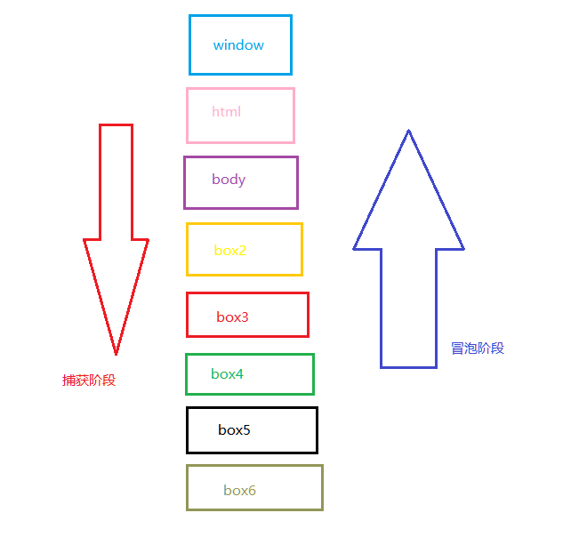
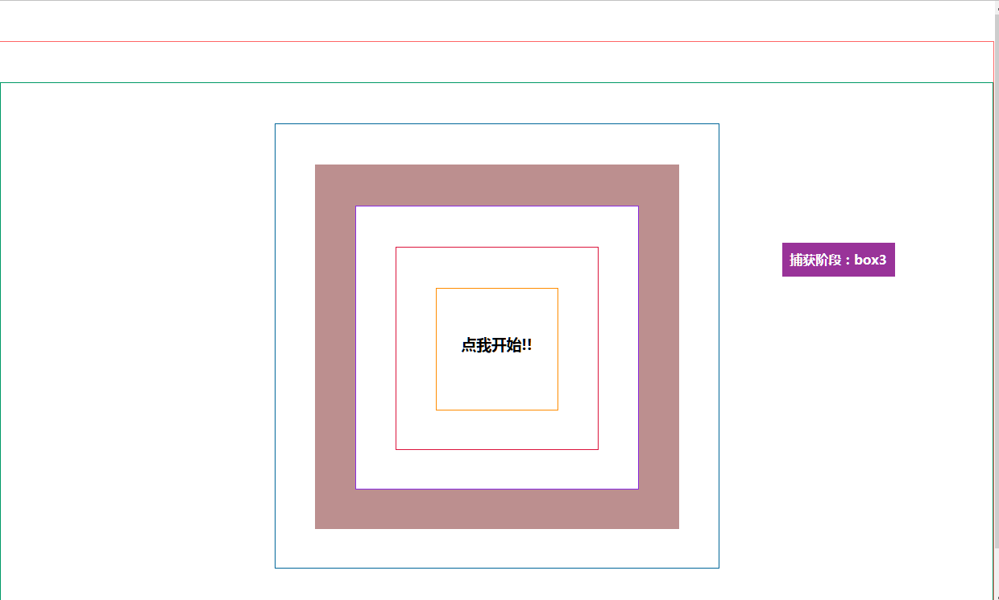
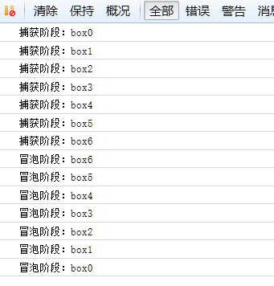
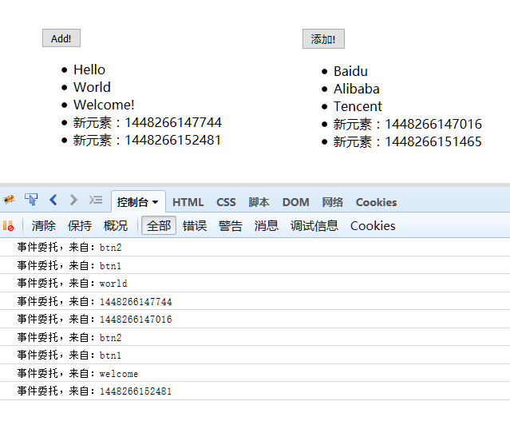

# JavaScript事件流
## 1.什么是JS事件流
　　早期的IE事件传播方向为由上至下，即从document逐级向下传播到目标元素（捕获）；而Netscape公司的Netscape Navigator则是朝相反的方向传播（冒泡），

也就是从目标元素开始向上逐级传播最终至window。

　　后来ECMAScript在**DOM2**中对事件流进行了进一步规范，基本上就是上述二者的结合。**当事件发生时，最先得到通知的是window，然后是document，由上至下逐级依次而入，直到真正触发事件的那个元素(目标元素)为止，这个过程就是捕获。接下来，事件会从目标元素开始起泡，由下至上逐级依次传播，直到window对象为止，这个过程就是冒泡。**

　　如果我们有下面的HTML代码结构
```
  <div class="box" id="box2">
              <div class="box" id="box3">
                  <div class="box" id="box4">
                      <div class="box" id="box5">
                          <div class="box" id="box6">
                             <h3>点我开始!!</h3>
                         </div>
                     </div>
                </div>
             </div>
         </div>
```
　　那么当我们点击box6中的HE以后，事件的触发过程也就是这样的：

　　

　　　　
## 2.DEMO实例
　　　　我在Gitbub上放了一个DEMO用于演示JS事件的传播原理，大家感兴趣的话可以前往查看。

　　　　http://xiaoyunchen.github.io/JavaScriptEvent/

　　　　打开页面后点击中央的"点我开始"，也就是从最里层触发click事件，然后页面将演示事件是如何进行捕获和冒泡两个阶段的传播的。

　　　　

　　　　同样在浏览器控制中也可以清楚的看出了JS事件的传播过程：


　代码源码放在了 https://github.com/xiaoyunchen/JavaScriptEvent 感兴趣的同学可以自行前往查看。

　　　　

## 3.有何用处
　　　　了解了JS事件流的传播原理，那么对我们的实际开发过程中有什么作用呢？

　　　　首先来看DOM2添加事件的方法申明：
```
element.addEventListener(event, function, useCapture);
/*
第一个参数是事件的类型 (如 "click" 或 "mousedown").
第二个参数是事件触发后调用的函数。
第三个参数是个布尔值用于描述事件是冒泡还是捕获。该参数是可选的。
*/
```
　　也就是说我们可以控制是在冒泡还是捕获阶段去处理事件，但是由于考虑浏览器兼容性的问题，这里一般我们都只是用false即冒泡阶段。

　　另外，根据事件的冒泡原理，我们还可以实现另外一个很重要的功能：**事件委托。**

　　比如我们上面的代码中，有很多元素都需要添加事件，按照之前的做法，我们需要去依次获取每个元素，然后再为每个事件添加上监听事件，

但是这样会带来一些问题：

　　<font color='orange'>1.多次操作DOM获取元素，势必会降低浏览器处理性能

　　2.事件不具有继承性，如果我们动态在页面中添加了一个元素，那么还需要重新走一遍上述程序为其添加监听事件</font>

　　好在我们通过JS事件的冒泡原理来解决上述问题：我们只监听最外层的元素，然后在事件函数中根据事件来源进行不同的事件处理。

　　这样的话，我们添加事件监听时只需要操作一个元素，极大的降低了DOM访问，同时也方便的监听事件的移除。而且就算动态在页面添加一个元素时，也不用

　　重复为其添加监听事件，因为它的事件会自动冒泡到外层被我们给截获。（这也是jquery中时间绑定的实现原理。）

　　

## 4.事件委托DEMO
 　　同样的，我创建了一个简单的DEMO用于样式事件委托：　http://xiaoyunchen.github.io/JavaScriptEvent/delegate.html

　　 在这个页面中，我们创建了两个列表，然后在两个列表的父级添加了一个事件委托，拦截了列表元素的所有click事件。

　　当我们点击两个列表的任何列表元素时，事件都能得到正确的响应，在控制台打印出对应的元素ID值，

　　当然哪怕是我们后台动态添加的li元素，不用再为其单独绑定事件，也可以得到正确的响应，这就是JS事件委托的作用。

　　

　　（注意，并不是所有事件都支持事件委托，比如mouseover，mouseout等就不支持事件委托。）

　　测试DEMO的源码同样放在了 https://github.com/xiaoyunchen/JavaScriptEvent 感兴趣的同学可以自行前往查看。

 

　　小结：

　　　　JavaScript中的事件流分为捕获阶段、目标阶段、冒泡阶段，我们可以JS控制需要操作捕获还是冒泡阶段的事件。

　　　　根据事件流的原理，我们可以优化事件处理方法，比如进行事件委托。

转载自：https://www.cnblogs.com/souvenir/p/4988367.html