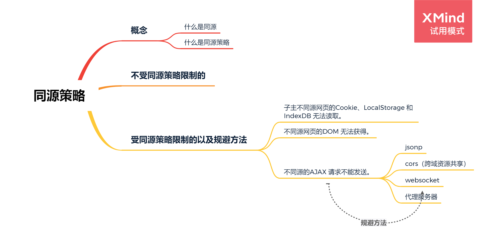

# 同源策略以及其规避方法
>在一场面试中，被问到类似同源策略针对的对象是什么，却答不上来。同源策略这个我是知道的，但是发现的问题就是我对知识点认识不太细致。可以说是一知半解。以及对于jsonp这种解决方式我也只答对了一般——动态创建script标签只是其中的一步，但发现很多对于jsonp的文章都没有解释到‘jsonp是请求一段脚本来执行’，所以忘以后每个知识都能细致了解

大纲

## 同源策略
   + 什么是同源  
   所谓同源是指：域名(www.baidu.com)、协议(http)、端口(8080) 相同。

   检测以下地址和http://www.cnblog.com/ricolee是否同源：
      URL|结果|	原因
      -|-|-
      http://www.cnblog.com/ricolee	|成功|	域名、协议、端口相同
      https://www.cnblog.com/ricolee|	失败|	协议不同
      http://www.cnblog.com:8888/ricolee |失败|	端口不同
      http://www.cnblog.cn/ricolee |	失败|	域名不同

+ 什么是同源策略  

     同源策略是浏览器的一个安全功能，不同源的客户端脚本在没有明确授权的情况下，不能读写对方资源。所以xyz.com下的js脚本采用ajax读取abc.com里面的文件数据是会被拒绝的。  

     同源策略限制了从同一个源加载的文档或脚本如何与来自另一个源的资源进行交互。这是一个用于隔离潜在恶意文件的重要安全机制。


## 不受同源策略限制的

1. 页面中的链接，重定向以及表单提交是不会受到同源策略限制的。  
2. 跨域资源的引入是可以的。但是js不能读写加载的内容。如嵌入到页面中的`<script src="..."></script>，，<link>，<iframe>`等。  
使用js脚本读写非同源的资源会被拒绝的（<font color='red'>跨域资源的引入是可以的，使用js读写则受限制</font>），因此 XMLHttpRequest 受同源策略限制。  
ps：这里我的理解是在dom中直接使用img标签是不存在跨域问题的，但是在js中动态引入存在跨域问题

## 受到同源限制的

1.  不同源网页的Cookie、LocalStorage 和 IndexDB 无法读取。

2.  不同源网页的DOM 无法获得。

3.  不同源的AJAX 请求不能发送。

## 对于同源策略的规避
**1.cookie跨域**  
<font color='orange'>Cookie 是服务器写入浏览器的一小段信息，只有同源的网页才能共享。但是，两个网页一级域名相同，只是二级域名不同，浏览器允许通过设置document.domain共享 Cookie</font>（https：//www.baidu.com 其中一级域名为baidu.com 二级域名为www）  

domain表示的是cookie所在的域，默认为请求的地址，如网址为`www.jb51.net/test/test.aspx`，那么domain默认为`www.jb51.net`  

而跨域访问，如域A为t1.test.com，域B为t2.test.com，那么在域A生产一个令域A和域B都能访问的cookie就要将该cookie的domain设置为.test.com；如果要在域A生产一个令域A不能访问而域B能访问的cookie就要将该cookie的domain设置为t2.test.com。
```bash
// A为t1.test.com,域B为t2.test.com
// 在A域设置此coolie的domain ，A和B都能访问到cookie
document.cookie = "blogCookie=blog;path=/;domain=.test.com";
```
>扩展1：所谓的单点登录是指用户在一个站点如`www.studyez.com`登录后切换到另一个站点`communty.studyez.com`时也自动 被community的Server判断为已经登录，反过来，只要用户在`community.studyez.com`登出后，切换到 `www.studyez.com`时后www的Server也会判断到这一用户已经登出  

>扩展2：
cookie路径 ：  
**cookie** 一般是由与用户访问页面而被创建的 ， 可是并不是只有在创建 cookie 的页面才可以访问这个cookie。在默认情况下，出于安全方面的考虑，只有与创建 cookie 的页面处于同一个目录或在创建cookie页面的子目录下的网页才可以访问。那么此时如果希望其父级或者整个网页都能够使用cookie，就需要进行路径的设置。  
**path** 表示cookie所在的目录，asp.net默认为/，就是根目录。在同一个服务器上有目录如下：/test/,/test/cd/,/test/dd/，现设一个cookie1的path为/test/，cookie2的path为/test/cd/，那么test下的所有页面都可以访问到cookie1，而/test/和/test/dd/的子页面不能访问cookie2。这是因为cookie能让其path路径下的页面访问。
```
document.cookie = "name = value; path=/";
```

**2.jsonp**  

基本思想：网页通过添加一个`<script>`元素，向服务器请求JSON数据，这种做法不受同源政策限制；服务器收到请求后，将数据放在一个指定名字的回调函数里传回来。————请求一段可执行的js脚本，并执行

首先，网页动态插入`<script>`元素，由它向跨源网址发出请求。

```bash
function addScriptTag(src) {
  var script = document.createElement('script');
  script.setAttribute("type","text/javascript");
  script.src = src;
  document.body.appendChild(script);
}
//可在需要请求跨域是发起，比如点击某个按钮请求资源
window.onload = function () {
  addScriptTag('http://example.com/ip?callback=foo');
}

function foo(data) {
  console.log('Your public IP address is: ' + data.ip);
};
```
以上，我们通过，script的src属性，请求服务器，并通过参数（如：？callback=foo，foo为本地一个执行的方法）告诉服务器返回指定格式的JS脚本，并将数据封装在此脚本中。  

服务器再配合客户端返回一段脚本 （如：* foo({“id”: 123, “name” : 张三, “age”: 17});* ），其实返回的就是 一个客户端本地的一个 可执行的方法的方法名, 并将要返回的 数据封装在了参数 里。

请求到资源后，本地就会执行此方法，通过对参数的处理，也就获取到了我们所要的数据。

**3.WebSocket**  

WebSocket是一种通信协议，使用ws://（非加密）和wss://（加密）作为协议前缀。该协议不实行同源政策，只要服务器支持，就可以通过它进行跨源通信。

下面是一个例子，浏览器发出的WebSocket请求的头信息（摘自维基百科）。
```
GET /chat HTTP/1.1
Host: server.example.com
Upgrade: websocket
Connection: Upgrade
Sec-WebSocket-Key: x3JJHMbDL1EzLkh9GBhXDw==
Sec-WebSocket-Protocol: chat, superchat
Sec-WebSocket-Version: 13
Origin: http://example.com
```
上面代码中，有一个字段是Origin，表示该请求的请求源（origin），即发自哪个域名。

正是因为有了Origin这个字段，所以WebSocket才没有实行同源政策。因为服务器可以根据这个字段，判断是否许可本次通信。如果该域名在白名单内，服务器就会做出如下回应。
```
HTTP/1.1 101 Switching Protocols
Upgrade: websocket
Connection: Upgrade
Sec-WebSocket-Accept: HSmrc0sMlYUkAGmm5OPpG2HaGWk=
Sec-WebSocket-Protocol: chat
```

**4.CORS**  

CORS是跨源资源分享（Cross-Origin Resource Sharing）的缩写,可在跨域资源分享CORS详情中见到详细解释

**5.服务器代理**


参考：[阮一峰的日志](http://www.ruanyifeng.com/blog/2016/04/same-origin-policy.html)
