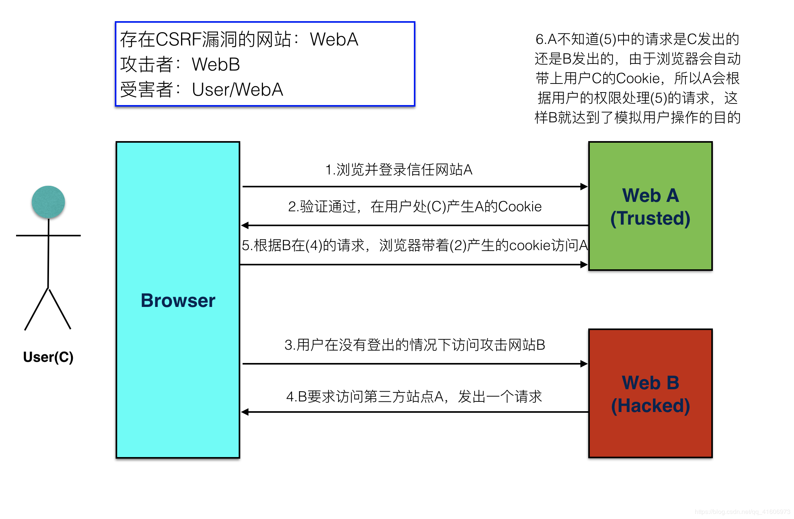

# web安全——跨站请求伪造CRSF

# csrf和csrf防御
**概念**
+ CSRF——（cross site request forgery)跨站请求伪造。
<!-- @import "[TOC]" {cmd="toc" depthFrom=1 depthTo=6 orderedList=false} -->

+ CSRF指攻击者盗用了你的身份，以你的名义发送恶意请求。  
包括：以你名义发送邮件，发消息，盗取你的账号，甚至于购买商品，虚拟货币转账......
+造成的问题：个人隐私泄露以及财产安全。

**CSRF攻击示意图**


## **CSRF防御**  

**1.Referer头检测法**  
Referer标识当前请求的来源页面，浏览器访问时除了自动带上Cookie还会自动带上Referer，所以服务端可以检测Referer头是否本网站页面来决定是否响应请求。

Referer是浏览器自动带上的，基于认为浏览器没有相关漏洞的前提下，我们可以认为攻击者是没法伪造Referer头的，也就是检测Referer头的方法是可靠的。

但该方式有时会不受认可，一是因为浏览器是可以设置禁止发送Referer头的，如果使用该方式那么禁止Referer头的浏览将无法正常使用，这可能会降低用户使用体验。二是因为由于移动端的崛起当下流行前后端分离app和web共用一套后端代码，但app是不会自动带Referer头的，如果使用该方式app端不好处理。

**2.在请求地址中添加token并验证**

csrf的关键在于，黑客可以轻松仿造用户的请求，验证用户身份的信息存放在Cookie中，所以可以直接使用Cookie来通过验证。要防御CSRF，<font color='orange'>关键在于请求中放入黑客所不能伪造的信息，并且该信息不存在于 cookie 之中。</font>用户在登录成功后，服务器端使用JWT创建一个token返回给前端，并把token存到session中。这样每次当服务器收到请求时，如果请求没有token或者验证token不正确，就拒绝请求。不过这种方法要对于每一个请求都加上token，很麻烦，容易漏掉。另外，对于页面中的每一个a链接和form表单，都加上token，如果页面中存在用户发布内容的地方，黑客发布自己web的链接，也能很容易获取到token。

CSRF Token的防护策略分为三个步骤：

1). 将CSRF Token输出到页面中

首先，用户打开页面的时候，服务器需要给这个用户生成一个Token，该Token通过加密算法对数据进行加密，一般Token都包括随机字符串和时间戳的组合，显然在提交时Token不能再放在Cookie中了，否则又会被攻击者冒用。因此，为了安全起见Token最好还是存在服务器的Session中，之后在每次页面加载时，使用JS遍历整个DOM树，对于DOM中所有的a和form标签后加入Token。这样可以解决大部分的请求，但是对于在页面加载之后动态生成的HTML代码，这种方法就没有作用，还需要程序员在编码时手动添加Token。

2).页面提交的请求携带这个Token

对于GET请求，Token将附在请求地址之后，这样URL 就变成 `http://url?csrftoken=tokenvalue`。 而对于 POST 请求来说，要在 form 的最后加上：

  `<input type=”hidden” name=”csrftoken” value=”tokenvalue”/>`

这样，就把Token以参数的形式加入请求了。

3).服务器验证Token是否正确

当用户从客户端得到了Token，再次提交给服务器的时候，服务器需要判断Token的有效性，验证过程是先解密Token，对比加密字符串以及时间戳，如果加密字符串一致且时间未过期，那么这个Token就是有效的。

这种方法要比之前检查Referer或者Origin要安全一些，Token可以在产生并放于Session之中，然后在每次请求时把Token从Session中拿出，与请求中的Token进行比对，但这种方法的比较麻烦的在于如何把Token以参数的形式加入请求。

## **几种常见的攻击类型**  

**1.GET类型的CSRF**

GET类型的CSRF利用非常简单，只需要一个HTTP请求，一般会这样利用：
```
 
 ```
在受害者访问含有这个img的页面后，浏览器会自动向`http://bank.example/withdraw?account=xiaoming&amount=10000&for=hacker`发出一次HTTP请求。bank.example就会收到包含受害者登录信息的一次跨域请求。

**2.POST类型的CSRF**Gmail案例

这种类型的CSRF利用起来通常使用的是一个自动提交的表单，如：
```
 <form action="http://bank.example/withdraw" method=POST>
    <input type="hidden" name="account" value="xiaoming" />
    <input type="hidden" name="amount" value="10000" />
    <input type="hidden" name="for" value="hacker" />
</form>
<script> document.forms[0].submit(); </script> 
```
访问该页面后，表单会自动提交，相当于模拟用户完成了一次POST操作。

POST类型的攻击通常比GET要求更加严格一点，但仍并不复杂。任何个人网站、博客，被黑客上传页面的网站都有可能是发起攻击的来源，后端接口不能将安全寄托在仅允许POST上面。

**3.链接类型的CSRF**

链接类型的CSRF并不常见，比起其他两种用户打开页面就中招的情况，这种需要用户点击链接才会触发。这种类型通常是在论坛中发布的图片中嵌入恶意链接，或者以广告的形式诱导用户中招，攻击者通常会以比较夸张的词语诱骗用户点击，例如：
```
  <a href="http://test.com/csrf/withdraw.php?amount=1000&for=hacker" taget="_blank">
  重磅消息！！
  <a/>
```
由于之前用户登录了信任的网站A，并且保存登录状态，只要用户主动访问上面的这个PHP页面，则表示攻击成功。


## **CSRF漏洞检测**  

检测CSRF漏洞是一项比较繁琐的工作，最简单的方法就是抓取一个正常请求的数据包，去掉Referer字段后再重新提交，如果该提交还有效，那么基本上可以确定存在CSRF漏洞。   

随着对CSRF漏洞研究的不断深入，不断涌现出一些专门针对CSRF漏洞进行检测的工具，如CSRFTester，CSRF Request Builder等。  

以CSRFTester工具为例，CSRF漏洞检测工具的测试原理如下：使用CSRFTester进行测试时，首先需要抓取我们在浏览器中访问过的所有链接以及所有的表单等信息，然后通过在CSRFTester中修改相应的表单等信息，重新提交，这相当于一次伪造客户端请求。如果修改后的测试请求成功被网站服务器接受，则说明存在CSRF漏洞，当然此款工具也可以被用来进行CSRF攻击。

参考文章：https://blog.csdn.net/xiaoxinshuaiga/article/details/80766369
