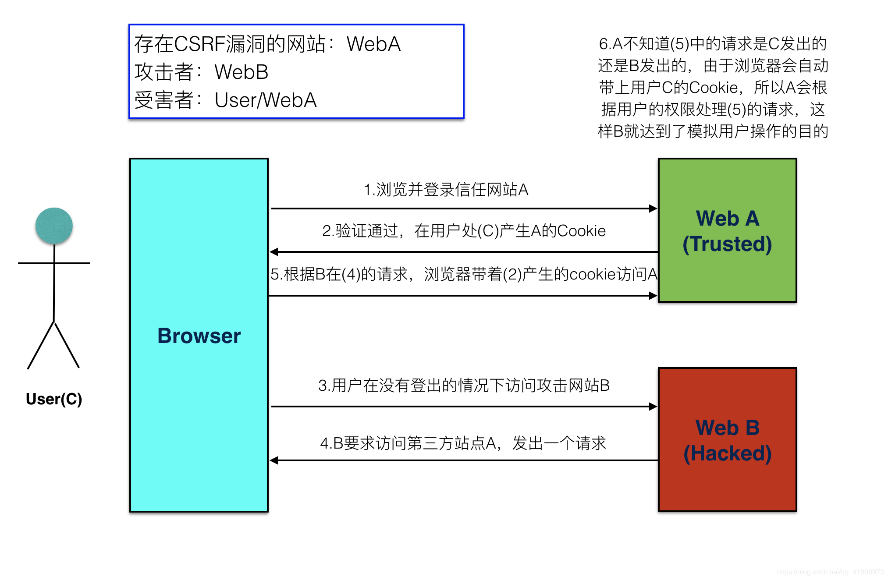

# web安全——跨站请求伪造CRSF

## 1.csrf和csrf防御
**概念**
+ CSRF——（cross site request forgery)跨站请求伪造。
+ CSRF指攻击者盗用了你的身份，以你的名义发送恶意请求。  
包括：以你名义发送邮件，发消息，盗取你的账号，甚至于购买商品，虚拟货币转账......
+造成的问题：个人隐私泄露以及财产安全。

**CSRF攻击示意图**

**CSRF防御**  

1.Referer头检测法  
Referer标识当前请求的来源页面，浏览器访问时除了自动带上Cookie还会自动带上Referer，所以服务端可以检测Referer头是否本网站页面来决定是否响应请求。

Referer是浏览器自动带上的，基于认为浏览器没有相关漏洞的前提下，我们可以认为攻击者是没法伪造Referer头的，也就是检测Referer头的方法是可靠的。

但该方式有时会不受认可，一是因为浏览器是可以设置禁止发送Referer头的，如果使用该方式那么禁止Referer头的浏览将无法正常使用，这可能会降低用户使用体验。二是因为由于移动端的崛起当下流行前后端分离app和web共用一套后端代码，但app是不会自动带Referer头的，如果使用该方式app端不好处理。

2.在请求地址中添加token并验证

csrf的关键在于，黑客可以轻松仿造用户的请求，验证用户身份的信息存放在Cookie中，所以可以直接使用Cookie来通过验证。要防御CSRF，关键在于请求中放入黑客所不能伪造的信息，并且该信息不存在于 cookie 之中。用户在登录成功后，服务器端使用JWT创建一个token返回给前端，并把token存到session中。这样每次当服务器收到请求时，如果请求没有token或者验证token不正确，就拒绝请求。不过这种方法要对于每一个请求都加上token，很麻烦，容易漏掉。另外，对于页面中的每一个a链接和form表单，都加上token，如果页面中存在用户发布内容的地方，黑客发布自己web的链接，也能很容易获取到token。

3.在HTTP头中自定义属性并验证

类似上面那种方案，把token放置到header中去。但是这种方法只适用于XMLHttpRequest做Ajax请求。

**CSRF漏洞检测**  

检测CSRF漏洞是一项比较繁琐的工作，最简单的方法就是抓取一个正常请求的数据包，去掉Referer字段后再重新提交，如果该提交还有效，那么基本上可以确定存在CSRF漏洞。   

随着对CSRF漏洞研究的不断深入，不断涌现出一些专门针对CSRF漏洞进行检测的工具，如CSRFTester，CSRF Request Builder等。  

以CSRFTester工具为例，CSRF漏洞检测工具的测试原理如下：使用CSRFTester进行测试时，首先需要抓取我们在浏览器中访问过的所有链接以及所有的表单等信息，然后通过在CSRFTester中修改相应的表单等信息，重新提交，这相当于一次伪造客户端请求。如果修改后的测试请求成功被网站服务器接受，则说明存在CSRF漏洞，当然此款工具也可以被用来进行CSRF攻击。

参考文章：https://blog.csdn.net/xiaoxinshuaiga/article/details/80766369
