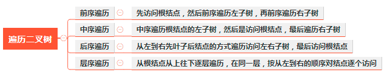
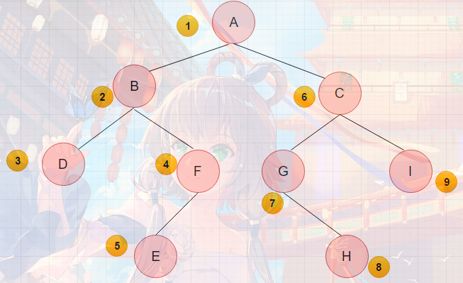
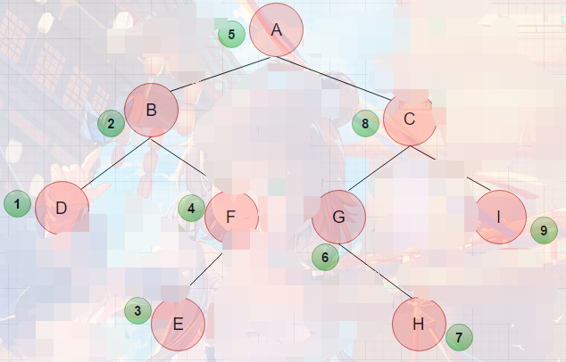

# 数据结构和算法

## 二叉树

>**概念**：二叉树是树的特殊一种，具有如下特点：1、每个结点最多有两颗子树，结点的度最大为2。2、左子树和右子树是有顺序的，次序不能颠倒。3、即使某结点只有一个子树，也要区分左右子树。

**二叉树深度定义**：从根结点到叶结点依次经过的结点（含根、叶结点）形成树的一条路径，最长路径的节点个数为树的深度

**二叉树遍历**  
* 二叉树的遍历（traversing binary tree）是指从根结点出发，按照某种次序依次访问二叉树中所有的结点，使得每个结点被访问依次且仅被访问一次  
四种遍历方式分别为：先序遍历、中序遍历、后序遍历、层序遍历。
* 


首先来看先序遍历，所谓的先序遍历就是先访问根节点，在访问左节点，最后访问右节点，

如上图所示，前序遍历结果为：ABDFECGHI

再者就是中序遍历，所谓的中序遍历就是先访问左节点，再访问根节点，最后访问右节点，

如上图所示，中序遍历结果为：DBEFAGHCI

最后就是后序遍历，所谓的中序遍历就是先访问左节点，再访问右节点，最后访问根节点。

后序遍历结果为：DEFBHGICA

**二叉树重建**  
例如输入前序遍历序列{1,2,4,7,3,5,6,8}和中序遍历序列{4,7,2,1,5,3,8,6}。

首先，根节点 是{ 1 }；  
左子树是：前序{ 2,4,7 } ，中序{ 4,7,2 }；  
右子树是：前序{ 3,5,6,8 } ，中序{ 5,3,8,6 }；  
这时，如果我们把左子树和右子树分别作为新的二叉树，则可以求出其根节点，左子树和右子树。  
这样，一直用这个方式，就可以实现重建二叉树


参考：
https://blog.csdn.net/weixin_42805929/java/article/details/82946080

---
## 单向链表


1)带头结点;  
  不带头结点

2)特点
1. data: 存储数据  
2. next: 指向下一个节点

3)链式存储;  
+ 链表的各个节点地址不一定是连续的,有跳跃;


4)节点:  
```
	(1)head头结点:   
		1.不存放具体的数据;  
		2.作用是: 表示单链表的头;  
		3.next域: 指向下一个节点

	(2)如何判断是否结束：根据next域,如果为null,则说明到大了末尾;

	(3)由于head节点不能动,因此加入辅助节点temp,这样利用temp就能遍历链表;

	(4)temp一定要后移,不然就是一个死循环;
```

原文链接：https://blog.csdn.net/themagickeyjianan/java/article/details/105815873
