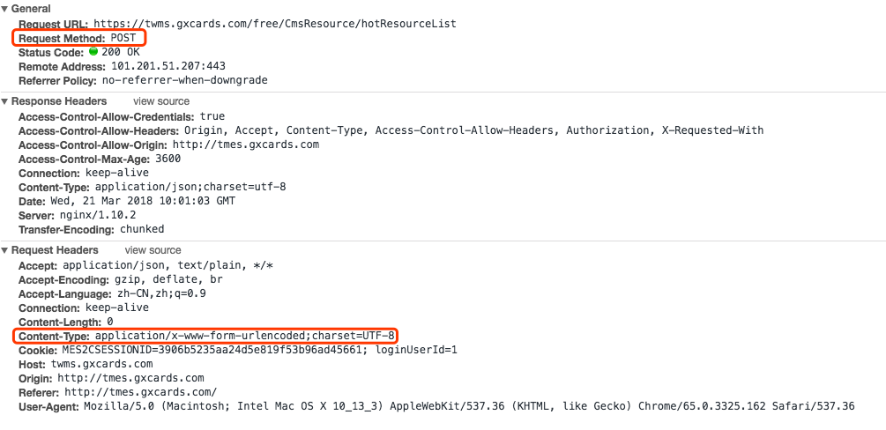
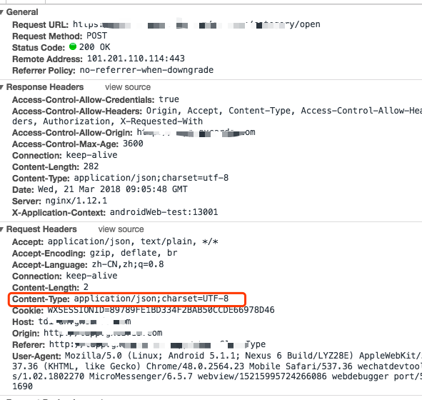

一、什么是CORS？
<!-- @import "[TOC]" {cmd="toc" depthFrom=1 depthTo=6 orderedList=false} -->


 CORS是一个W3C标准，全称是“跨域资源共享(Cross-origin resource sharing)”,它允许浏览器向跨源服务器发出XHR请求，从而解决了跨域的问题。


二、简介

CORS需要浏览器和服务器同时支持。（IE10- 不支持）。

整个CORS通信过程，都是浏览器自动完成，不需要用户参与。                                                        对于开发者来说，CORS通信与同源的AJAX通信没有差别，代码完全一样。浏览器一旦发现AJAX请求跨源，就会自动添加一些附加的头信息，有时还会多出一次附加的请求，从而解决跨域请求，但用户不会有感觉。

因此，实现CORS通信的关键是服务器。只要服务器实现了CORS接口，就可以跨源通信。


三、两种请求

CORS请求分为两种：简单请求 和 非简单请求。

只要同时满足以下两大条件，就属于简单请求。浏览器对于简单请求和非简单请求的处理方式是不一样的。

（1) 请求方法是以下三种方法之一：
```
HEAD
GET
POST
```
（2）HTTP的头信息不超出以下几种字段：
```
Accept
Accept-Language
Content-Language
Last-Event-ID
Content-Type：只限于三个值 application/x-www-form-urlencoded、multipart/form-data、text/plain
```
凡是不同时满足上面两个条件的，就属于非简单请求。


四、简单请求

**4.1 基本流程**

对于简单请求，浏览器直接发出CORS请求。具体来说，就是在头信息之中，增加一个Origin字段。

下面是一个例子，浏览器发现这次跨源AJAX请求是简单请求，就自动在头信息之中，添加一个Origin字段。

这个请求同时满足POST 和 application/x-www-form-urlencoded，所以是简单请求。


上面的头信息中，Origin字段用来说明，本次请求来自哪个源（协议 + 域名 + 端口）。服务器根据这个值，决定是否同意这次请求。

如果Origin指定的源，不在许可范围内，服务器会返回一个正常的HTTP回应。浏览器发现，这个回应的头信息没有包含Access-Control-Allow-Origin字段（详见下文），就知道出错了，从而抛出一个错误，被XMLHttpRequest的onerror回调函数捕获。注意，这种错误无法通过状态码识别，因为HTTP回应的状态码有可能是200。

如果Origin指定的域名在许可范围内，服务器返回的响应，会多出几个头信息字段。
```
Access-Control-Allow-Origin: http://***
Access-Control-Allow-Credentials: true
Access-Control-Expose-Headers: FooBar
Content-Type: text/html; charset=utf-8
```
上面的头信息之中，有三个与CORS请求相关的字段，都以Access-Control-开头。

（1）Access-Control-Allow-Origin

该字段是必须的。它的值要么是请求时Origin字段的值，要么是一个*，表示接受任意域名的请求。

（2）Access-Control-Allow-Credentials

该字段可选。它的值是一个布尔值，表示是否允许发送Cookie。默认情况下，Cookie不包括在CORS请求之中。设为true，即表示服务器明确许可，Cookie可以包含在请求中，一起发给服务器。那么需要在浏览器端也设置允许cookie。这个值也只能设为true，如果服务器不要浏览器发送Cookie，删除该字段即可。

（3）Access-Control-Expose-Headers

该字段可选。CORS请求时，XMLHttpRequest对象的getResponseHeader()方法只能拿到6个基本字段：Cache-Control、Content-Language、Content-Type、Expires、Last-Modified、Pragma。如果想拿到其他字段，就必须在Access-Control-Expose-Headers里面指定。上面的例子指定，getResponseHeader('FooBar')可以返回FooBar字段的值。

**4.2 withCredentials 属性**

上面说到，CORS请求默认不发送Cookie和HTTP认证信息。如果要把Cookie发到服务器，一方面要服务器同意，指定Access-Control-Allow-Credentials字段。

Access-Control-Allow-Credentials: true
另一方面，开发者必须在AJAX请求中打开withCredentials属性。
```
var xhr = new XMLHttpRequest();
xhr.withCredentials = true;
```
否则，即使服务器同意发送Cookie，浏览器也不会发送。或者，服务器要求设置Cookie，浏览器也不会处理。

但是，如果省略withCredentials设置，有的浏览器还是会一起发送Cookie。这时，可以显式关闭withCredentials。

xhr.withCredentials = false;
需要注意的是，如果要发送Cookie，Access-Control-Allow-Origin就不能设为星号，必须指定明确的、与请求网页一致的域名。同时，Cookie依然遵循同源政策，只有用服务器域名设置的Cookie才会上传，其他域名的Cookie并不会上传，且（跨源）原网页代码中的document.cookie也无法读取服务器域名下的Cookie。

五、非简单请求

**5.1 预检请求**

非简单请求是那种对服务器有特殊要求的请求，比如请求方法是PUT或DELETE，或者Content-Type字段的类型是application/json。

非简单请求的CORS请求，会在正式通信之前，增加一次HTTP查询请求，称为"预检"请求（preflight）。

浏览器先询问服务器，当前网页所在的域名是否在服务器的许可名单之中，以及可以使用哪些HTTP动词和头信息字段。只有得到肯定答复，浏览器才会发出正式的XMLHttpRequest请求，否则就报错。
下面是非简单的请求



浏览器发现，这是一个非简单请求，就自动发出一个"预检"请求，要求服务器确认可以这样请求。下面是这个"预检"请求的HTTP头信息。我们就会发现在我们的 Network当中多了一次请求。


"预检"请求用的请求方法是OPTIONS，表示这个请求是用来询问的。头信息里面，关键字段是Origin，表示请求来自哪个源。

除了Origin字段，"预检"请求的头信息包括两个特殊字段。

（1）Access-Control-Request-Method

该字段是必须的，用来列出浏览器的CORS请求会用到哪些HTTP方法，上例是PUT。

（2）Access-Control-Request-Headers

该字段是一个逗号分隔的字符串，指定浏览器CORS请求会额外发送的头信息字段，上例是X-Custom-Header。

5.2 预检请求的回应

服务器收到"预检"请求以后，检查了Origin、Access-Control-Request-Method和Access-Control-Request-Headers字段以后，确认允许跨源请求，就可以做出回应

HTTP回应中，关键的是Access-Control-Allow-Origin字段，表示`http://***`可以请求数据。该字段也可以设为星号，表示同意任意跨源请求

Access-Control-Allow-Origin: *
如果浏览器否定了"预检"请求，会返回一个正常的HTTP回应，但是没有任何CORS相关的头信息字段。这时，浏览器就会认定，服务器不同意预检请求，因此触发一个错误，被XMLHttpRequest对象的onerror回调函数捕获。控制台会打印出如下的报错信息。

服务器回应的其他CORS相关字段如下。
```
Access-Control-Allow-Methods: GET, POST, PUT
Access-Control-Allow-Headers: X-Custom-Header
Access-Control-Allow-Credentials: true
Access-Control-Max-Age: 3600
```
（1）Access-Control-Allow-Methods

该字段必需，它的值是逗号分隔的一个字符串，表明服务器支持的所有跨域请求的方法。注意，返回的是所有支持的方法，而不单是浏览器请求的那个方法。这是为了避免多次"预检"请求。

（2）Access-Control-Allow-Headers

如果浏览器请求包括Access-Control-Request-Headers字段，则Access-Control-Allow-Headers字段是必需的。它也是一个逗号分隔的字符串，表明服务器支持的所有头信息字段，不限于浏览器在"预检"中请求的字段。

（3）Access-Control-Allow-Credentials

该字段与简单请求时的含义相同。

（4）Access-Control-Max-Age

该字段可选，用来指定本次预检请求的有效期，单位为秒。上面结果中，有效期是20天（1728000秒），即允许缓存该条回应1728000秒（即20天），在此期间，不用发出另一条预检请求。

5.3 浏览器的正常请求和回应

一旦服务器通过了"预检"请求，以后每次浏览器正常的CORS请求，就都跟简单请求一样，会有一个Origin头信息字段。服务器的回应，也都会有一个Access-Control-Allow-Origin头信息字段。
